# Execution Copilot - 系统详细设计文档

**文档版本**: v1.4  
**创建日期**: 2025-09-28  
**最后更新**: 2025-12-23  
**作者**: 郗继常  
**状态**: 待批准  

## 目录

**1. [概述](#1-概述)**

- 1.1 [项目背景](#11-项目背景)
- 1.2 [目标和范围](#12-目标和范围)
- 1.3 [关键特性](#13-关键特性)
- 1.4 [技术栈](#14-技术栈)
- 1.5 [术语表](#15-术语表)

**2. [需求分析](#2-需求分析)**

- 2.1 [功能需求](#21-功能需求)
- 2.2 [非功能需求](#22-非功能需求)

**3. [系统架构](#3-系统架构)**

- 3.1 [整体架构](#31-整体架构)
- 3.2 [技术架构](#32-技术架构)
- 3.3 [部署架构](#33-部署架构)
- 3.4 [数据流架构](#34-数据流架构)

**4. [技术设计](#4-技术设计)**

- 4.1 [核心模块设计](#41-核心模块设计)
  - 4.1.1 [主机管理模块](#411-主机管理模块)
  - 4.1.2 [硬件审核模块](#412-硬件审核模块)
  - 4.1.3 [任务执行模块](#413-任务执行模块)

**5. [接口设计](#5-接口设计)**

- 5.1 [浏览器插件接口](#51-浏览器插件接口)
  - 5.1.1 [用户界面](#511-用户界面)
  - 5.1.2 [业务流程](#512-业务流程)
  - 5.1.3 [外部 Token 认证](#513-外部-token-认证外部硬件服务接口)
  - 5.1.4 [页面信息抓取](#514-页面信息抓取)
  - 5.1.5 [获取主机列表](#515-获取主机列表)
  - 5.1.6 [获取VNC连接信息](#516-获取vnc连接信息)
  - 5.1.7 [重试VNC连接](#517-重试vnc连接)
  - 5.1.8 [释放主机](#518-释放主机)
  - 5.1.9 [上报连接结果](#519-上报连接结果)
- 5.2 [Agent客户端接口](#52-agent客户端接口)
  - 5.2.1 [项目概述](#521-项目概述)
  - 5.2.2 [安装流程](#522-安装流程)
  - 5.2.3 [启动流程](#523-启动流程)
  - 5.2.4 [业务流程](#524-业务流程)
  - 5.2.5 [安装依赖](#525-安装依赖)
  - 5.2.6 [配置说明](#526-配置说明)
  - 5.2.7 [日志说明](#527-日志说明)
  - 5.2.8 [注意事项](#528-注意事项)
- 5.3 [服务端接口](#53-服务端接口)
  - 5.3.1 [获取配置信息](#531-获取配置信息)
  - 5.3.2 [判断主机是否存在](#532-判断主机是否存在)
  - 5.3.3 [上报硬件信息](#533-上报硬件信息)
  - 5.3.4 [连接状态上报](#534-连接状态上报)
  - 5.3.5 [Case结果上报](#535-case结果上报)
  - 5.3.6 [更新结果通知](#536-更新结果通知)
  - 5.3.7 [WebSocket接口](#537-websocket接口)
- 5.4 [管理后台接口](#54-管理后台接口)
  - 5.4.1 [用户界面](#541-用户界面)
  - 5.4.2 [主机管理](#542-主机管理)
  - 5.4.3 [主机审批](#543-主机审批)
  - 5.4.4 [OTA管理](#544-ota管理)

**6. [Redis 使用](#6-redis-使用)**

- 6.1 [外部 API Token 缓存](#61-外部-api-token-缓存)
- 6.2 [Token 黑名单](#62-token-黑名单)
- 6.3 [系统配置缓存](#63-系统配置缓存)
- 6.4 [WebSocket 跨实例通信](#64-websocket-跨实例通信)
- 6.5 [分布式锁](#65-分布式锁)

**7. [定时任务](#7-定时任务)**

- 7.1 [Case 超时检测任务](#71-case-超时检测任务)
- 7.2 [WebSocket 心跳检查任务](#72-websocket-心跳检查任务)
- 7.3 [连接池管理任务](#73-连接池管理任务)

**8. [附录](#8-附录)**

- 8.1 [性能指标](#81-性能指标)
- 8.2 [服务器建议](#82-服务器建议)
- 8.3 [状态码定义](#83-状态码定义)
- 8.4 [变更记录](#84-变更记录)

---

## 1. 概述

### 1.1 项目背景

Execution Copilot 系统是为了解决大规模测试环境中主机资源管理、任务调度和状态监控的问题而设计的。系统支持500+测试主机的统一管理，提供浏览器插件、Agent客户端和管理后台三个核心组件。

### 1.2 目标和范围

**主要目标**：

- 实现测试主机的自动化管理和监控
- 提供便捷的主机连接和任务执行能力
- 支持硬件变更审核和OTA更新机制
- 确保系统高可用性和可扩展性

**系统范围**：

- 浏览器插件：用户交互界面
- Agent客户端：主机端代理服务
- EC服务端：核心业务逻辑和
- 管理后台：系统管理

### 1.3 关键特性

- **智能主机管理**：自动发现、注册和状态监控
- **硬件变更审核**：审核机制确保环境稳定性
- **实时任务执行**：支持EK/EM组件的远程调用
- **OTA更新机制**：支持强制更新和回滚
- **高可用架构**：支持500个并发用户和10000次/小时查询

### 1.4 技术栈

- **后端**：Python, RESTful API, WebSocket
- **数据库**：关系型数据库
- **前端**：浏览器插件 (JavaScript)
- **客户端**：Agent (Python)
- **通信协议**：HTTP/HTTPS, WebSocket

### 1.5 术语表

- **Agent**：部署在测试主机上的客户端代理服务，负责主机信息收集、任务执行和状态上报
- **EK (Execution Kit)**：测试执行工具包，用于执行具体的测试任务，现有 Intel 内部系统
- **EM (Execution Monitor)**：执行监控组件，用于监控测试执行状态，现有 Intel 内部系统
- **HOST**：测试主机，指运行Agent的物理机
- **VNC**：RealVNC远程桌面连接
- **OTA (Over-The-Air)**：空中下载技术，用于远程更新软件
- **TC_ID**：Test Case ID，测试用例标识符
- **MachineGuid**：Windows系统机器唯一标识符
- **Intel服务端**：Intel现有的服务系统，提供用户认证和数据同步功能
- **EC服务端**：Execution Copilot服务端，本系统的核心后端服务
- **Phoenix页面**：Intel内部测试管理页面

---

## 2. 需求分析

### 2.1 功能需求

#### 2.1.1 用户角色定义

- **测试工程师**：使用浏览器插件连接和操作测试主机
- **系统管理员**：通过管理后台管理主机和审核变更

#### 2.1.2 核心功能

**浏览器插件功能**：

- 用户身份验证和授权
- 主机列表获取和筛选
- VNC连接配置生成
- 连接状态恢复

**Agent客户端功能**：

- 主机自动注册和心跳上报
- 硬件信息收集和变更检测
- 测试任务执行和结果上报
- 自动更新和配置管理

**管理后台功能**：

- 主机状态监控和管理
- 硬件变更审核流程
- OTA更新配置和下发

### 2.2 非功能需求

#### 2.2.1 性能要求

- **并发处理**：支持500个并发用户
- **响应时间**：
  - 插件操作 <= 2秒
  - 配置查询 <= 5秒
  - 主机连接 <= 3秒
- **吞吐量**：10000次配置查询/小时

---

## 3. 系统架构

### 3.1 整体架构


### 3.2 技术架构

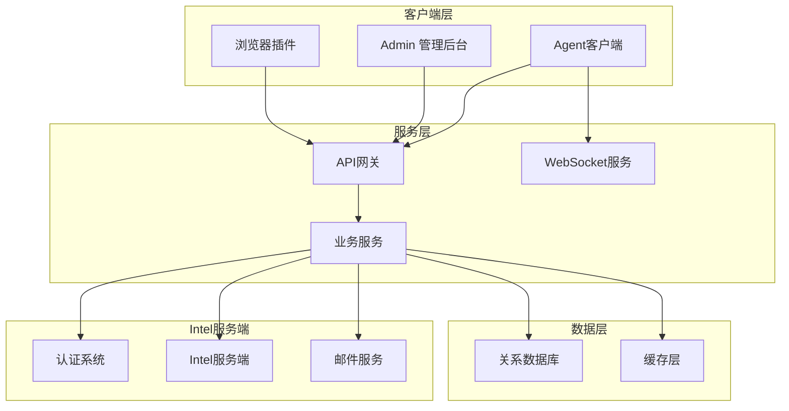
```mermaid
graph TB
    subgraph "客户端层"
        A[浏览器插件]
        B[Agent客户端]
        Z[Admin 管理后台]
    end
    
    subgraph "服务层"
        C[API网关]
        D[业务服务]
        E[WebSocket服务]
    end
    
    subgraph "数据层"
        F[关系数据库]
        G[缓存层]
    end
    
    subgraph "Intel服务端"
        I[认证系统]
        J[Intel服务端]
        K[邮件服务]
    end
    
    A --> C
    Z --> C
    B --> C
    B --> E
    C --> D
    D --> F
    D --> G
    D --> I
    D --> J
    D --> K
```

### 3.3 部署架构

**推荐服务器配置**：

- **业务服务器**：8CPU, 16G RAM, 500G HD
- **数据库服务器**：Intel 提供
- **部署需求**：满足性能要求最小单元部署

### 3.4 数据流架构

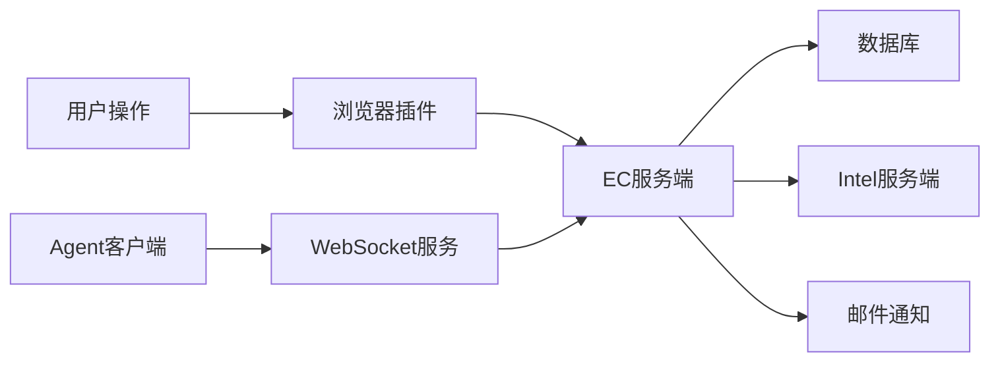
```mermaid
flowchart LR
    A[用户操作] --> B[浏览器插件]
    B --> C[EC服务端]
    C --> D[数据库]
    
    E[Agent客户端] --> F[WebSocket服务]
    F --> C
    
    C --> G[Intel服务端]
    C --> H[邮件通知]
```

---

## 4. 技术设计

### 4.1 核心模块设计

#### 4.1.1 主机管理模块

**职责**：

- 主机注册和状态管理
- 硬件信息收集和变更检测
- 主机生命周期管理

**状态流转图**：

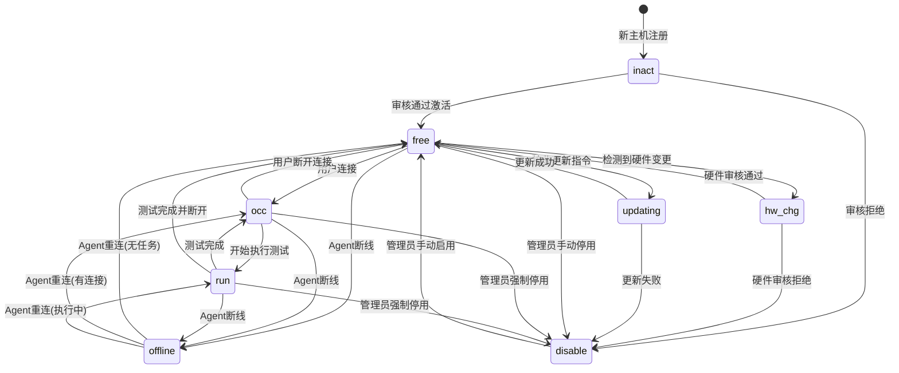
```mermaid
stateDiagram-v2
    [*] --> inact: 新主机注册
    inact --> free: 审核通过激活
    inact --> disable: 审核拒绝
    
    free --> occ: 用户连接
    free --> offline: Agent断线
    free --> hw_chg: 检测到硬件变更
    free --> updating: 接收更新指令
    
    occ --> run: 开始执行测试
    occ --> free: 用户断开连接
    occ --> offline: Agent断线
    
    run --> occ: 测试完成
    run --> free: 测试完成并断开
    run --> offline: Agent断线
    
    offline --> free: Agent重连(无任务)
    offline --> occ: Agent重连(有连接)
    offline --> run: Agent重连(执行中)
    
    hw_chg --> free: 硬件审核通过
    hw_chg --> disable: 硬件审核拒绝
    
    updating --> free: 更新成功
    updating --> disable: 更新失败
    
    disable --> free: 管理员手动启用
    
    free --> disable: 管理员手动停用
    occ --> disable: 管理员强制停用
    run --> disable: 管理员强制停用
```

#### 4.1.2 硬件审核模块

**模块职责**：硬件信息收集、变更检测和审核管理

##### 工作流程

**步骤1：Agent 信息收集**

- Agent获取硬件版本：收集设备硬件版本号
- Agent获取硬件信息：agent主动收集设备硬件信息\被动接收HW硬件信息上报（V1.2)
- Agent上报版本信息：将收集的信息发送到服务器

**步骤2：Server 信息处理**

- Server接收信息：接收Agent上报的数据
- 读取数据库配置模板：从数据库中获取预定义的配置标准和模板
- 信息比对分析：将上报信息与数据库配置进行对比分析

**步骤3：变更类型判断与处理**

- 新增类型：首次出现的设备类型，记录信息并等待审核
- 版本号变更：软件/固件版本变化，无论硬件是否变化，记录并等待审核(支持批量审核)
- 硬件变化：仅硬件配置变化而版本号不变，记录并等待审核
- 无变化：信息完全匹配，无需任何处理

**步骤4：审核管理**

- 批量审核：针对版本号变更类型支持批量审核操作
- 审核通过：同步到Intel服务，host保持启用状态
- 审核拒绝：host将被标记为不可用状态

**定期执行：硬件信息定期检测**（V1.2）

- 触发条件：硬件信息获取时间大于24小时（间隔时间从EC server获取，动态配置），并且host没有case在执行
- 执行流程：接收EK执行结果上报→agent检测上一次硬件获取时间与当前时间是否大于24小时→Y获取硬件信息，上报EC server

##### 审核流程图

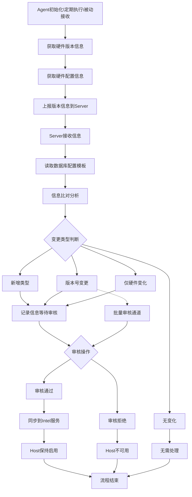
```mermaid
graph TD
    A[Agent初始化\定期执行\被动接收] --> B[获取硬件版本信息]
    B --> C[获取硬件配置信息]
    C --> D[上报版本信息到Server]
    D --> E[Server接收信息]
    E --> F[读取数据库配置模板]
    F --> G[信息比对分析]
    
    G --> H{变更类型判断}
    H --> I[新增类型]
    H --> J[版本号变更]
    H --> K[仅硬件变化]
    H --> L[无变化]
    
    I --> M[记录信息等待审核]
    J --> M
    K --> M
    L --> N[无需处理]
    
    M --> O{审核操作}
    O --> P[审核通过]
    O --> Q[审核拒绝]
    
    P --> R[同步到Intel服务]
    R --> S[Host保持启用]
    S --> T[流程结束]
    
    Q --> U[Host不可用]
    U --> T
    
    N --> T
    
    %% 批量审核特殊路径
    J -.-> V[批量审核通道]
    V --> O
```

#### 4.1.3 任务执行模块

**模块职责**：任务下发、执行监控和结果收集

##### 执行流程

**阶段1：任务下发**

- Server下发任务：向Agent发送任务指令和执行参数
- 传递执行参数：包含任务类型、配置参数、执行要求等信息

**阶段2：Agent执行**

- Agent接收参数：解析并验证接收到的任务参数
- 调用EK服务：向外部EK（Execution Kernel）服务发起调用请求

**阶段3：异步通知**

- 等待EK回调：调用成功后进入等待状态，监听EK服务的回调通知
- 通知Server执行状态：Agent在调用EK后立即通知Server任务已开始执行
- Server记录执行中状态：Server将任务状态更新为“执行中”

**阶段4：结果回调**

- EK回调通知：EK服务执行完成后回调Agent
- Agent上报结果：将执行结果（成功/失败）上报给Server

**阶段5：结果记录**

- Server记录最终状态：更新任务最终状态（success/failed）
- 记录执行日志：保存完整的执行日志信息

##### 执行状态管理图

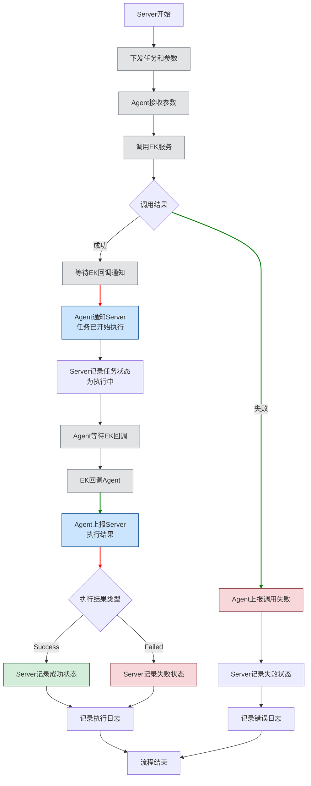
```mermaid
flowchart TD
    A[Server开始] --> B[下发任务和参数]
    B --> C[Agent接收参数]
    C --> D[调用EK服务]
    
    D --> E{调用结果}
    E -->|成功| F[等待EK回调通知]
    E -->|失败| G[Agent上报调用失败]
    
    F --> H[Agent通知Server<br>任务已开始执行]
    H --> I[Server记录任务状态<br>为执行中]
    
    I --> J[Agent等待EK回调]
    J --> K[EK回调Agent]
    K --> L[Agent上报Server<br>执行结果]
    
    L --> M{执行结果类型}
    M -->|Success| N[Server记录成功状态]
    M -->|Failed| O[Server记录失败状态]
    
    N --> P[记录执行日志]
    O --> P
    
    G --> Q[Server记录失败状态]
    Q --> R[记录错误日志]
    
    P --> S[流程结束]
    R --> S
    
    %% 连接线样式
    linkStyle 5 stroke:green,stroke-width:2px
    linkStyle 6 stroke:red,stroke-width:2px
    linkStyle 10 stroke:green,stroke-width:2px
    linkStyle 11 stroke:red,stroke-width:2px
    
    %% 样式定义
    classDef success fill:#d4edda,stroke:#155724
    classDef failed fill:#f8d7da,stroke:#721c24
    classDef process fill:#e2e3e5,stroke:#6c757d
    classDef notify fill:#cce5ff,stroke:#004085
    
    class N success
    class O,G failed
    class B,C,D,F,J,K process
    class H,L notify
```

##### 时序说明

**任务启动阶段**：
Server → Agent → EK服务  

1. Server发送任务指令和参数  
2. Agent接收并验证参数  
3. Agent调用EK服务开始执行  

**状态通知阶段**：
Agent → Server  
4. Agent通知Server任务已开始执行  
5. Server更新任务状态为“执行中”  
6. Agent进入等待回调状态  

**结果处理阶段**：
EK服务 → Agent → Server  
7. EK服务执行完成，回调Agent  
8. Agent接收回调结果  
9. Agent上报最终执行结果给Server  
10. Server记录最终状态和日志

---

## 5. 接口设计

### 5.1 浏览器插件接口

#### 5.1.1 用户界面


#### 5.1.2 业务流程

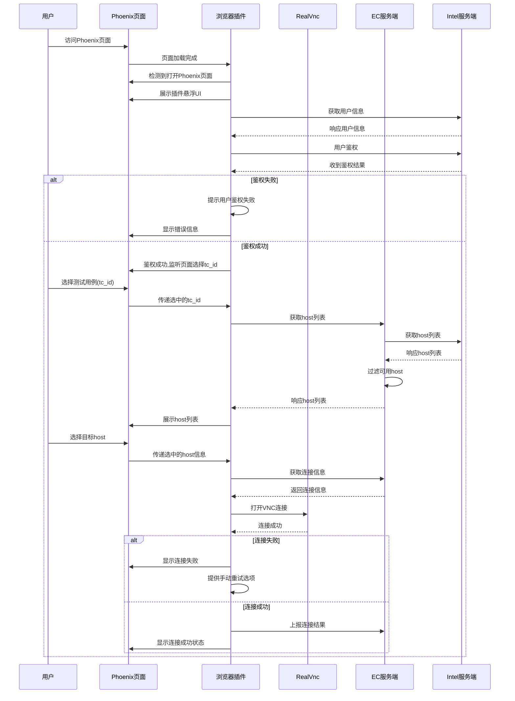
```mermaid
sequenceDiagram
    participant 用户
    participant Phoenix页面
    participant 浏览器插件
    participant RealVnc
    participant EC服务端
    participant Intel服务端

    用户->>Phoenix页面: 访问Phoenix页面
    Phoenix页面->>浏览器插件: 页面加载完成
    浏览器插件->>Phoenix页面: 检测到打开Phoenix页面
    浏览器插件->>Phoenix页面: 展示插件悬浮UI
    
    浏览器插件->>Intel服务端: 获取用户信息
    Intel服务端-->>浏览器插件: 响应用户信息
    浏览器插件->>Intel服务端: 用户鉴权
    Intel服务端-->>浏览器插件: 收到鉴权结果
    
    alt 鉴权失败
        浏览器插件->>浏览器插件: 提示用户鉴权失败
        浏览器插件->>Phoenix页面: 显示错误信息
    else 鉴权成功
        浏览器插件->>Phoenix页面: 鉴权成功,监听页面选择tc_id
        用户->>Phoenix页面: 选择测试用例(tc_id)
        Phoenix页面->>浏览器插件: 传递选中的tc_id
        
        浏览器插件->>EC服务端: 获取host列表
        EC服务端->>Intel服务端: 获取host列表
        Intel服务端-->>EC服务端: 响应host列表
        EC服务端->>EC服务端: 过滤可用host
        EC服务端-->>浏览器插件: 响应host列表
        
        浏览器插件->>Phoenix页面: 展示host列表
        用户->>Phoenix页面: 选择目标host
        Phoenix页面->>浏览器插件: 传递选中的host信息
        
        浏览器插件->>EC服务端: 获取连接信息
        EC服务端-->>浏览器插件: 返回连接信息
        
        浏览器插件->>RealVnc: 打开VNC连接
        RealVnc-->>浏览器插件: 连接成功
        
        alt 连接失败
            浏览器插件->>Phoenix页面: 显示连接失败
            浏览器插件->>浏览器插件: 提供手动重试选项
        else 连接成功
            浏览器插件->>EC服务端: 上报连接结果
            浏览器插件->>Phoenix页面: 显示连接成功状态
        end
    end
```

**插件工作流程**：

1. 只在 `https://hsdes.intel.com/appstore/phoenix/` 域名时工作
2. 获取当前登录的用户信息
3. 用户鉴权验证

**用户信息获取**：

```javascript
fetch('https://hsdes.intel.com/rest/user?expand=personal', {
  credentials: 'include',
  headers: { 'Accept': 'application/json' }
}).then(r => r.text()).then(data => console.log('Response:', data));
```

#### 5.1.3 外部 Token 认证（外部硬件服务接口）

**接口地址**：`{HARDWARE_API_URL}/api/v1/auth/login`  
**请求方法**：`POST`  
**功能描述**：获取外部硬件服务的访问令牌（Token），用于后续接口认证

**基础 URL**：通过环境变量 `HARDWARE_API_URL` 配置，默认值为 `http://hardware-service:8000`

**认证要求**：无需认证（公开接口）

**请求参数**：

#### Headers

| 参数名 | 类型 | 必填 | 说明 |
|--------|------|------|------|
| Content-Type | string | 是 | `application/json` |

#### Request Body

```json
{
  "email": "user@example.com"
}
```

**请求字段说明**：

- `email`: 用户邮箱地址（必需），从 `sys_user` 表根据 `user_id` 查询获取

**响应格式**：

#### 成功响应 (200)

```json
{
  "access_token": "eyJhbGciOiJIUzI1NiIsInR5cCI6IkpXVCJ9...",
  "token_type": "bearer",
  "expires_in": "15552000"
}
```

**响应字段说明**：

- `access_token`: 访问令牌，用于后续接口认证
- `token_type`: Token 类型，通常为 `"bearer"`
- `expires_in`: 过期时间（秒），默认 `15552000` 秒（约 180 天）

#### 错误响应

```json
{
  "message": "认证失败",
  "code": 401
}
```

**业务逻辑**：

1. 根据 `user_id` 查询 `sys_user` 表获取用户邮箱
2. 先从 Redis 缓存获取 token（缓存键：`external_api_token:{user_email}`）
3. 如果缓存为空，使用 `asyncio.Lock` 防止并发请求，调用登录接口获取 token
4. 根据 `expires_in` 的值将 token 存入 Redis 缓存
5. 返回完整的 token 信息

**Redis 使用**：

- **缓存键格式**：`external_api_token:{user_email}`
- **过期时间**：根据 `expires_in` 字段动态设置（默认 15552000 秒，约 180 天）
- **并发控制**：使用 `asyncio.Lock` 防止多个协程同时请求 token

**使用场景**：

- 调用外部硬件接口前自动获取并缓存 Token
- 审批同意接口（`/api/admin/v1/host/appr`）- 新增/修改硬件时
- 主机删除接口（`/api/admin/v1/host`）- 删除硬件时

**相关代码**：

- `services/host-service/app/services/external_api_client.py::get_external_api_token()`

#### 5.1.4 页面信息抓取

**功能描述**：从 Phoenix 页面抓取测试用例相关信息

**触发时机**：用户选择了 tc_id 时触发

**操作步骤**：

1. 从特定元素中获取 cycle_name、user_name
2. 每隔200毫秒轮询获取 tc_id（考虑页面加载延迟，直至获取到元素或用户勾选了新的 tc_id）
3. 获取过程中，插件状态为加载中
4. 通过页面中抓取的参数，获取 host 列表

#### 5.1.5 获取主机列表（EC服务接口）

**接口地址**：`/api/v1/hosts`  
**请求方法**：`POST`  
**功能描述**：根据测试用例信息获取可用的主机列表

**请求参数**：

```json
{
  "tc_id": "1852278641262084097",
  "cycle_name": "gkvk@poxe.vlli",
  "user_name": "gkvk@poxe.vlli"
}
```

**请求字段说明**：

- `tc_id`: 测试用例 ID
- `cycle_name`: 测试周期名称
- `user_name`: 用户名

**响应格式**：

```json
[
    {
        "id": "1852278641262084097",
        "user_name": "gkvk@poxe.vlli"
    }
]
```

**响应字段说明**：

- `id`: 主机ID
- `user_name`: 主机所属用户

#### 5.1.6 获取VNC连接信息（EC服务接口）

**接口地址**：`/api/v1/conn`  
**请求方法**：`POST`  
**功能描述**：获取指定主机的VNC连接信息

**修改日期**：2025-10-17
**修改描述**: 新增 `user_id` 参数

**请求参数**：

```json
{
  "id": "1852278641262084097",
  "user_id": "1852278641262084097"
}
```

**请求字段说明**：

- `id`: 主机ID

**响应格式**：

```json
{
    "ip": "192.168.101.118",
    "port": "5900",
    "username": "neusoft",
    "***REMOVED***word": "***REMOVED***"
}
```

**响应字段说明**：

- `ip`: VNC服务器IP地址
- `port`: VNC服务端口
- `username`: 连接用户名
- `***REMOVED***word`: 连接密码

**VNC配置示例**：

```vnc
Host=192.168.101.118::5900
UserName=sendiyang
Password=***REMOVED***
```

#### 5.1.7 重试VNC连接（EC服务接口）

**接口地址**：`/api/v1/retry`  
**请求方法**：`POST`  
**功能描述**：重试VNC连接，获取用户之前连接的主机列表

**请求参数**：

```json
{
  "user_id": "1852278641262084097"
}
```

**请求字段说明**：

- `user_id`: 用户ID

**响应格式**：

```json
[
    {
        "tc_id": "15014591568",
        "host_list": [
            {
                "id": "1852278641262084097",
                "user_name": "gkvk@poxe.vlli"
            }
        ]
    }
]
```

**响应字段说明**：

- `tc_id`: 测试用例ID
- `host_list`: 可用主机列表
  - `id`: 主机ID
  - `user_name`: 主机所属用户

#### 5.1.8 释放主机（EC服务接口）

**接口地址**：`/api/v1/free`  
**请求方法**：`POST`  
**功能描述**：释放用户占用的主机资源

**请求参数**：

```json
{
    "user_id": "adb1852278641262sdf097",
    "host_list": [
        "1852278641262084097",
        "1852278641262084098"
    ]
}
```

**请求字段说明**：

- `user_id`: 用户ID
- `host_list`: 需要释放的主机ID列表

**响应格式**：

```json
{
    "code": "200",
    "msg": "ok"
}
```

**响应字段说明**：

- `code`: 状态码
- `msg`: 响应消息

#### 5.1.9 上报连接结果（EC服务接口）

**接口地址**：`/api/v1/report`  
**请求方法**：`POST`  
**功能描述**：上报VNC连接结果到服务端

**修改日期**：2025-10-17
**修改描述**: 新增 `tc_id,cycle_name,user_name` 参数

**请求参数**：

```json
{
  "user_id": "1852278641262084097",
  "tc_id": "1852278641262084097",
  "cycle_name": "gkvk@poxe.vlli",
  "user_name": "gkvk@poxe.vlli",
  "host_id": "1852278641262084097",
  "connection_status": "success",
  "connection_time": "2025-10-11T10:30:00Z"
}
```

**请求字段说明**：

- `user_id`: 用户ID
- `host_id`: 主机ID
- `connection_status`: 连接状态 (success/failed)
- `connection_time`: 连接时间

**响应格式**：

```json
{
    "code": "200",
    "msg": "ok"
}
```

**响应字段说明**：

- `code`: 状态码
- `msg`: 响应消息

### 5.2 Agent客户端接口

#### 5.2.1 项目概述

agent 服务，用于采集 host 测试节点的硬件以及主机信息，调度 host 测试节点中的 Execution Kit 与 Execution Monitor 服务，监听 RealVNC 连接状态，并可实时与服务端进行通信。

#### 5.2.2 安装流程

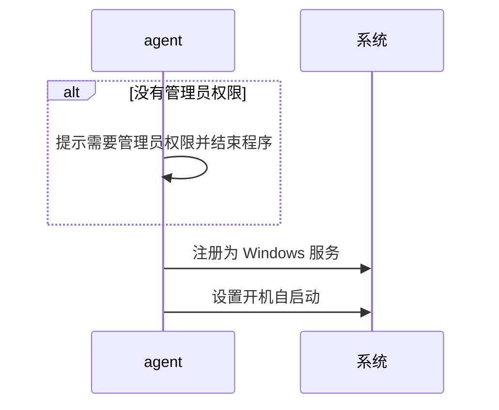
```mermaid
sequenceDiagram
    participant agent
    participant 系统

    alt 没有管理员权限
        agent->>agent: 提示需要管理员权限并结束程序
    end
    agent->>系统: 注册为 Windows 服务
    agent->>系统: 设置开机自启动
```

**安装逻辑**：

- **管理员权限**：没有管理员权限时，提示用户需要管理员权限并结束程序
- **服务注册**：注册为 Windows 服务
- **开机自启动**：设置开机自启动

#### 5.2.3 启动流程

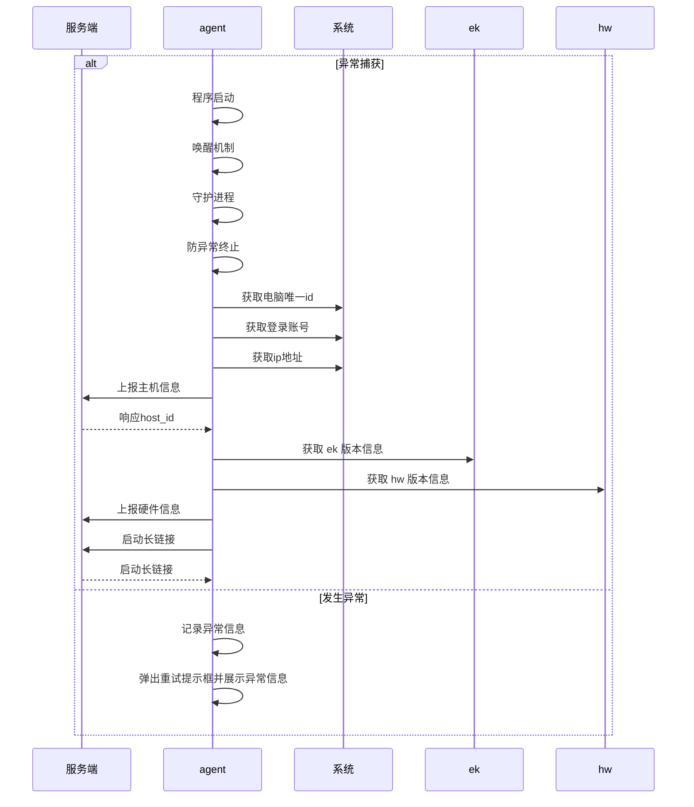
```mermaid
sequenceDiagram
    participant 服务端
    participant agent
    participant 系统
    participant ek
    participant hw

    alt 异常捕获
        agent->>agent: 程序启动
        agent->>agent: 唤醒机制
        agent->>agent: 守护进程
        agent->>agent: 防异常终止
        agent->>系统: 获取电脑唯一id
        agent->>系统: 获取登录账号
        agent->>系统: 获取ip地址
        agent->>服务端: 上报主机信息
        服务端-->>agent: 响应host_id
        agent->>ek: 获取 ek 版本信息
        agent->>hw: 获取 hw 版本信息
        agent->>服务端: 上报硬件信息
        agent->>服务端: 启动长链接
        服务端-->>agent: 启动长链接
    else 发生异常
        agent->>agent: 记录异常信息
        agent->>agent: 弹出重试提示框并展示异常信息
    end
```

**启动逻辑**：

- **唤醒机制**：使用 Windows API 每 30 秒发送一次唤醒信号，防止电脑自动息屏和睡眠
- **守护进程**：创建一个监控进程来重启意外终止的程序
- **防异常终止**：包含信号处理、异常捕获和优雅退出机制
- **完善的日志系统**：详细记录服务运行状态、错误信息和操作日志
- **进程管理**：通过PID文件确保服务唯一性，防止重复启动
- **配置灵活**：支持通过配置文件自定义服务参数
- **自更新**：支持自动检查并更新服务代码，保持最新功能和修复 bug

#### 5.2.4 业务流程

##### A. 服务启动相关接口

**A1. 获取电脑唯一ID**
> Agent 能力

获取方式：

```python
import winreg
import os

def get_machine_guid():
    """
    获取 Windows 系统的 MachineGuid。
    """
    try:
        key = winreg.OpenKey(winreg.HKEY_LOCAL_MACHINE,
                                "SOFTWARE\\Microsoft\\Cryptography",
                                0, winreg.KEY_READ)
        try:
            value, regtype = winreg.QueryValueEx(key, "MachineGuid")
            return value
        finally:
            winreg.CloseKey(key)
    except FileNotFoundError:
        print("MachineGuid not found in registry.")
        return None
    except PermissionError:
        print("Permission denied accessing registry. Try running as administrator.")
        return "N/A (Error reading file)"
    except Exception as e:
        print(f"An error occurred: {e}")
        return None

if __name__ == '__main__':
    guid = get_machine_guid()
    if guid:
        print(f"MachineGuid: {guid}")
    else:
        print("Could not retrieve MachineGuid.")
```

**A2. 获取电脑登录账号**
> Agent 能力

获取方式：

```python
import get***REMOVED***

username = get***REMOVED***.getuser()
print(f"当前登录用户名: {username}")
```

**A3. 获取主机环境**
> Agent 能力

获取方式：

```python
# 获取主机ip地址
import socket 
import fcntl 
import struct 

def get_ip_address(ifname): 
    s = socket.socket(socket.AF_INET, socket.SOCK_DGRAM) 
    return socket.inet_ntoa(fcntl.ioctl( 
        s.fileno(), 
        0x8915, # SIOCGIFADDR 
        struct.pack('256s', ifname[:15]) 
    )[20:24]) 

#get_ip_address('lo')环回地址 
#get_ip_address('eth0')主机ip地址
```

**A4. 上报主机信息**

> 此接口在服务启动时调用，用于获取在`EC服务` 中，代表当前 `host` 的 `host_id` 业务主键，在之后的 agent 与 server 交互中，以`host_id`进行业务串联,上报接口由 EC服务提供。

**接口地址**：`/api/v1/check`  
**请求方法**：POST

**请求体**：

```json
{
  "mg_id": "string(电脑唯一id)",
  "ip": "string(主机ip地址)",
  "user_name": "string(当前主机登录账号的用户名)"
}
```

**响应体**：

```json
{
  "id": "number(host_id)"
}
```

**A5. 获取版本信息**
> Intel 提供能力。

```bash
# ek 版本查询
ek version

# hw 版本查询
hw version
```

**A6. 上报硬件信息**

> Agent 采集硬件信息后上报到服务端，服务端提供能力。

**接口地址**：`/api/v1/agent/hardware/report`  
**请求方法**：`POST`  
**功能描述**：Agent 上报主机硬件信息，系统会自动检测硬件变更

**详细文档**：详见 [5.3.3 上报硬件信息](#533-上报硬件信息)

**A7. 长链接**

**接口地址**：WebSocket连接  
**请求方法**：WebSocket

##### B. 任务执行相关接口

**B1. 启动测试流程**

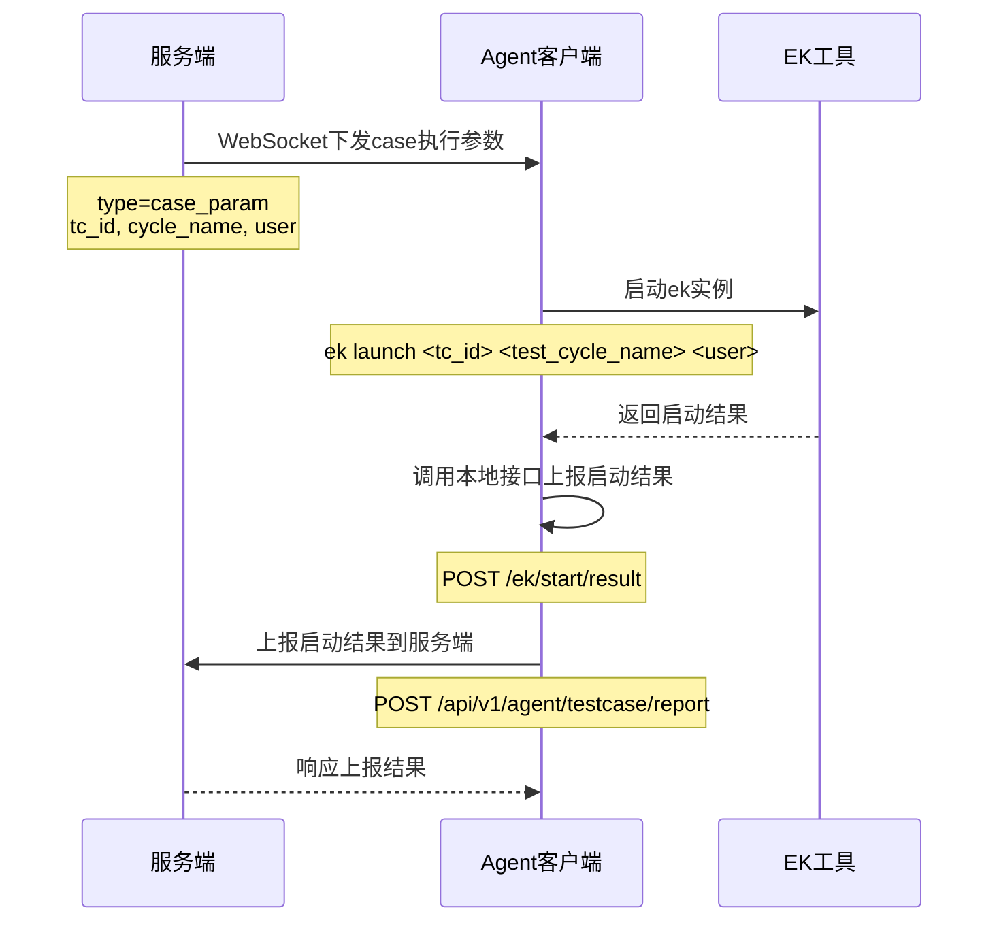
```mermaid
sequenceDiagram
    participant Server as 服务端
    participant Agent as Agent客户端
    participant EK as EK工具

    Server->>Agent: WebSocket下发case执行参数
    Note over Server: type=case_param<br/>tc_id, cycle_name, user
    Agent->>EK: 启动ek实例
    Note over Agent: ek launch <tc_id> <test_cycle_name> <user>
    EK-->>Agent: 返回启动结果
    Agent->>Agent: 调用本地接口上报启动结果
    Note over Agent: POST /ek/start/result
    Agent->>Server: 上报启动结果到服务端
    Note over Agent: POST /api/v1/agent/testcase/report
    Server-->>Agent: 响应上报结果
```

**命令行操作**：

```bash
# 查看ek 实例是否存在
ek ps                    # 显示基本信息
ek ps --verbose          # 显示详细信息（内存、CPU使用率等）

# 如果实例存在，进行清理
ek kill                  # 交互式选择要终止的进程
ek kill --pid 12345      # 终止指定PID的进程
ek kill --all            # 终止所有ek进程（需要确认）
ek kill --all --force    # 强制终止所有ek进程（无需确认）

# 启动 ek 实例
ek launch <tc_id> <test_cycle_name> <user>
```

**启动失败流程**：
启动失败会重新启动，默认重试三次，如三次后仍然失败，则会弹窗提示窗口。
窗口有两个按钮：

- 放弃：终止启动过程，不进行重试
- 重试：重新启动 ek 实例，最多重试三次

**B2. EK启动结果上报接口** (由 Agent 提供，本地接口)

> 此接口由 Agent 本地提供，等待 EK 工具调用，用于接收 EK 启动结果

**接口地址**：`/ek/start/result`  
**请求方法**：`POST`  
**功能描述**：接收 EK 工具启动后的结果回调

**请求参数**：

```json
{
  "tool": "execution_kit",
  "timestamp": "2025-09-24T08:15:30.123Z",
  "session_id": "uuid-session-identifier",
  "event": {
      "type": "start",
      "status_code": 0,
      "details": {
          "tc_id": "1852278641262084097",
          "test_cycle": "test_cycle_name",
          "user": "user@intel.com"
      }
  }
}
```

**请求字段说明**：

- `tool`: 工具类型，固定为 `"execution_kit"`
- `timestamp`: 时间戳（ISO 8601 格式）
- `session_id`: 会话ID（UUID）
- `event.type`: 事件类型，固定为 `"start"`
- `event.status_code`: 启动状态码，`0` 表示成功，`1` 表示异常
- `event.details.tc_id`: 测试用例 ID
- `event.details.test_cycle`: 测试周期名称
- `event.details.user`: 用户名

**响应格式**：

```json
{
    "code": 0,
    "msg": "success"
}
```

**响应字段说明**：

- `code`: 状态码，`0` 表示成功，`1` 表示异常
- `msg`: 响应描述

**业务逻辑**：

1. Agent 接收 EK 工具的启动结果回调
2. Agent 解析结果并整理数据
3. Agent 调用服务端接口上报启动结果：`POST /api/v1/agent/testcase/report`
4. 服务端更新 `host_exec_log` 表的执行状态

**B3. EK测试结果上报接口** (由 Agent 提供，本地接口)

> 此接口由 Agent 本地提供，等待 EK 工具调用，用于接收 EK 测试完成后的结果回调

**接口地址**：`/ek/test/result`  
**请求方法**：`POST`  
**功能描述**：接收 EK 工具测试完成后的结果回调

**请求参数**：

```json
{
  "tool": "execution_kit",
  "timestamp": "2025-09-24T08:15:30.123Z",
  "session_id": "uuid-session-identifier",
  "event": {
      "type": "end",
      "status_code": 0,
      "details": {
          "tc_id": "1852278641262084097",
          "test_cycle": "test_cycle_name",
          "user": "user@intel.com"
      }
  }
}
```

**请求字段说明**：

- `tool`: 工具类型，固定为 `"execution_kit"`
- `timestamp`: 时间戳（ISO 8601 格式）
- `session_id`: 会话ID（UUID）
- `event.type`: 事件类型，固定为 `"end"`
- `event.status_code`: 测试状态码，`0` 表示成功，`1` 表示异常
- `event.details.tc_id`: 测试用例 ID
- `event.details.test_cycle`: 测试周期名称
- `event.details.user`: 用户名

**响应格式**：

```json
{
    "code": 0,
    "msg": "success"
}
```

**响应字段说明**：

- `code`: 状态码，`0` 表示成功，`1` 表示异常
- `msg`: 响应描述

**业务逻辑**：

1. Agent 接收 EK 工具的测试结果回调
2. Agent 解析结果并整理数据
3. Agent 调用服务端接口上报测试结果：`POST /api/v1/agent/testcase/report`
4. 服务端更新 `host_exec_log` 表的执行状态和结果信息

**B4. EK结果汇报流程**

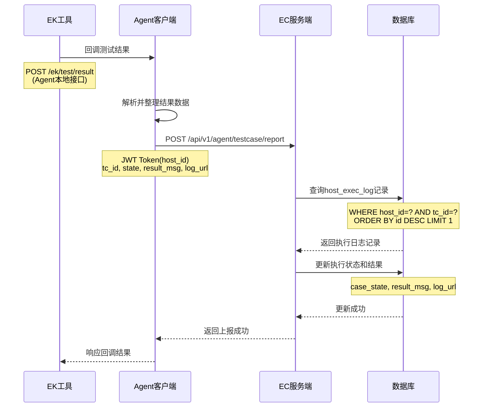
```mermaid
sequenceDiagram
    participant EK as EK工具
    participant Agent as Agent客户端
    participant Server as EC服务端
    participant DB as 数据库

    EK->>Agent: 回调测试结果
    Note over EK: POST /ek/test/result<br/>(Agent本地接口)
    Agent->>Agent: 解析并整理结果数据
    Agent->>Server: POST /api/v1/agent/testcase/report
    Note over Agent: JWT Token(host_id)<br/>tc_id, state, result_msg, log_url
    Server->>DB: 查询host_exec_log记录
    Note over DB: WHERE host_id=? AND tc_id=?<br/>ORDER BY id DESC LIMIT 1
    DB-->>Server: 返回执行日志记录
    Server->>DB: 更新执行状态和结果
    Note over DB: case_state, result_msg, log_url
    DB-->>Server: 更新成功
    Server-->>Agent: 返回上报成功
    Agent-->>EK: 响应回调结果
```

**B5. 服务端测试用例结果上报接口** (由 EC 服务端提供)

> Agent 调用此接口将 EK 测试结果上报到服务端

**接口地址**：`/api/v1/agent/testcase/report`  
**请求方法**：`POST`  
**功能描述**：Agent 上报测试用例执行结果，系统会更新执行日志记录

**详细文档**：详见 [5.3.5 Case结果上报](#535-case结果上报)

**B6. 硬件信息上报接口** (由 Agent 提供，本地接口)

> 此接口由 Agent 本地提供，等待 HW 工具调用，用于接收硬件信息采集结果

**接口地址**：`/dmr/info/result`  
**请求方法**：`POST`  
**功能描述**：接收 HW 工具采集的硬件信息结果回调

**请求参数**：

```json
{
  "tool": "dmr_config_schema",
  "timestamp": "2025-09-24T08:15:30.123Z",
  "event": {
      "type": "completion",
      "status_code": 0,
      "details": {
          "mode": "sut",
          "output_file": "/path/to/hardware_info.json",
          "output_data": {
              "dmr_config": {
                  "revision": 1,
                  "mainboard": {
                      "revision": 1,
                      "board": {
                          "board_meta_data": {
                              "host_name": "MyHost001",
                              "serial_number": "SN12345"
                          }
                      }
                  }
              }
          }
      }
  }
}
```

**请求字段说明**：

- `tool`: 工具类型，固定为 `"dmr_config_schema"`
- `timestamp`: 时间戳（ISO 8601 格式）
- `event.type`: 事件类型，固定为 `"completion"`
- `event.status_code`: 状态码，`0` 表示成功，`1` 表示异常
- `event.details.mode`: 模式，例如 `"sut"`
- `event.details.output_file`: 结果文件地址（可选）
- `event.details.output_data`: 结果数据（JSON格式，包含 `dmr_config` 等硬件信息）

**响应格式**：

```json
{
    "code": 0,
    "msg": "success"
}
```

**响应字段说明**：

- `code`: 状态码，`0` 表示成功，`1` 表示异常
- `msg`: 响应描述

**业务逻辑**：

1. Agent 接收 HW 工具的硬件信息采集结果回调
2. Agent 解析 `output_data` 中的硬件信息
3. Agent 调用服务端接口上报硬件信息：`POST /api/v1/agent/hardware/report`
4. 服务端进行硬件变更检测和审核流程

**B7. 服务端硬件信息上报接口** (由 EC 服务端提供)

> Agent 调用此接口将硬件信息上报到服务端

**接口地址**：`/api/v1/agent/hardware/report`  
**请求方法**：`POST`  
**功能描述**：Agent 上报主机硬件信息，系统会自动检测硬件变更

**详细文档**：详见 [5.3.3 上报硬件信息](#533-上报硬件信息)

##### C. 更新相关接口

**C1. 应用自更新**

> 收到服务端更新指令时进行调用。Agent 能力。

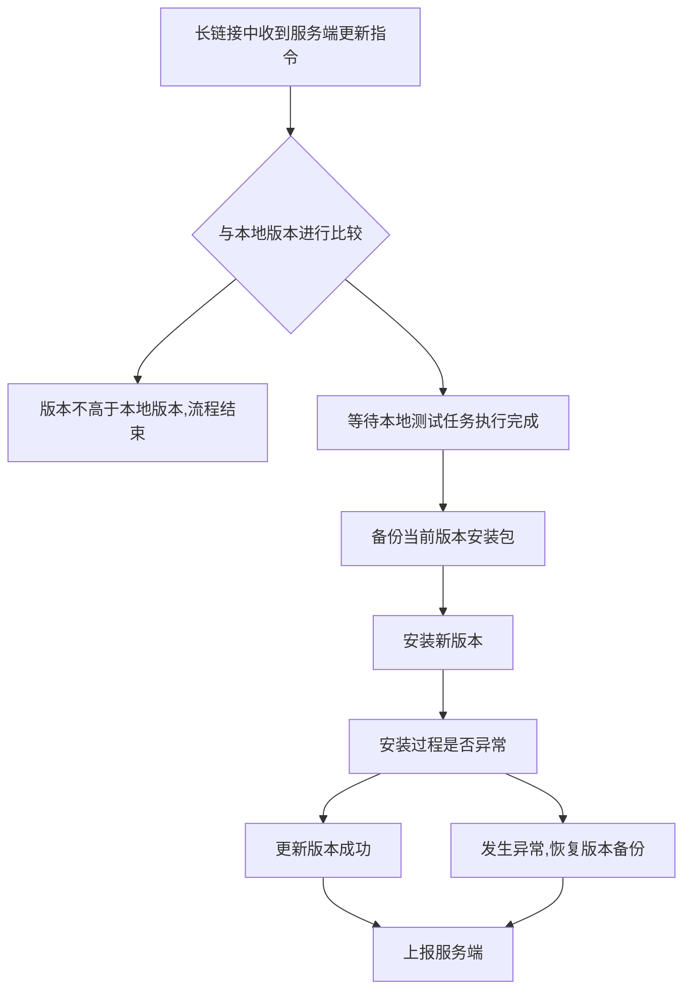
```mermaid
flowchart TD
    A[长链接中收到服务端更新指令] --> B{与本地版本进行比较}
    B --> C[版本不高于本地版本,流程结束]
    B --> J[等待本地测试任务执行完成]
    J --> D[备份当前版本安装包]
    D --> E[安装新版本]
    E --> F[安装过程是否异常]
    F --> G[发生异常,恢复版本备份]
    F --> H[更新版本成功]
    H --> I[上报服务端]
    G --> I
```

**自更新命令**：

```bash
# 更新当前应用
pip install -U xxx.whl
```

**C2. 更新其他应用**
> 收到服务端更新指令时进行调用。Agent 能力。

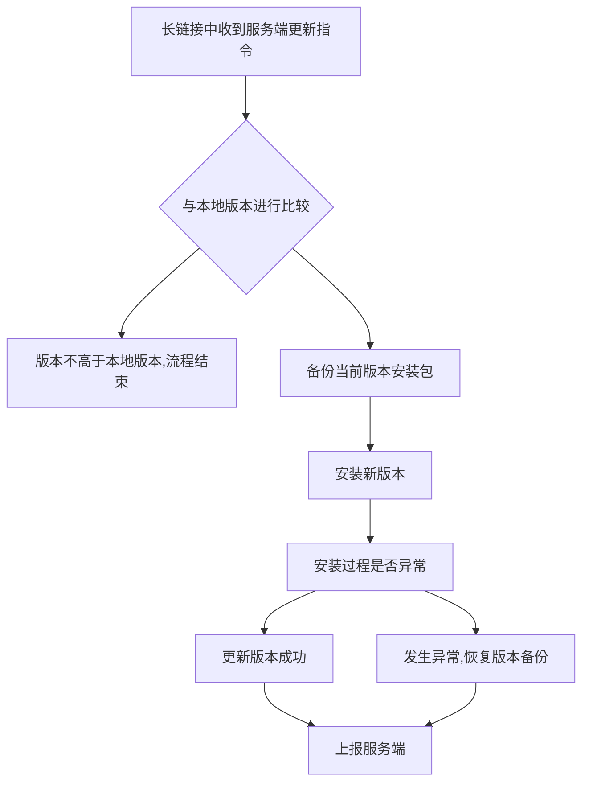
```mermaid
flowchart TD
    A[长链接中收到服务端更新指令] --> B{与本地版本进行比较}
    B --> C[版本不高于本地版本,流程结束]
    B --> D[备份当前版本安装包]
    D --> E[安装新版本]
    E --> F[安装过程是否异常]
    F --> G[发生异常,恢复版本备份]
    F --> H[更新版本成功]
    H --> I[上报服务端]
    G --> I
```

**更新命令**：

```bash
# 未安装应用时进行安装
pip install <other_app>.whl

# 更新应用
pip install -U <other_app>.whl
```

**更新结果上报接口**：

**接口地址**：`/api/v1/upd`  
**请求方法**：POST  
**接口描述**：此接口用于上报更新结果到服务端

**请求体**：

```json
{
  "id": "string(host_id)",
  "biz_key": "string(业务key)",
  "biz_ver": "string(执行更新版本号)",
  "biz_state": "number(updating: 1, 更新中. success: 2, 成功. failed: 3, 失败.)"
}
```

**响应体**：

```json
{
    "code": "200",
    "msg": "ok"
}
```

#### 5.2.5 安装依赖

1. 确保已安装Python 3.8或更高版本
2. 确保电脑使用 Windows 账号登录，VNC 业务将会使用

#### 5.2.6 配置说明

服务支持通过 `config.py` 文件进行配置，主要配置项如下：

- `KEEP_ALIVE_INTERVAL`：保持唤醒的时间间隔（秒），默认为30秒
- `LOG_LEVEL`：日志级别，可选值：DEBUG、INFO、WARNING、ERROR，默认为INFO
- `LOG_FILE`：日志文件路径，默认为"screen_keep_alive.log"
- `PID_FILE`：进程ID文件路径，默认为"screen_keep_alive.pid"
- `MAX_RETRIES`：最大重试次数，默认为3次
- `RETRY_INTERVAL`：重试间隔（秒），默认为5秒
- `ENABLE_FALLBACK`：是否启用备用唤醒方案，默认为True

#### 5.2.7 日志说明

- 服务会同时在控制台和日志文件中输出日志信息
- 日志文件会自动进行轮转，防止单个日志文件过大
- 日志包含时间戳、日志级别和详细信息，便于排查问题

#### 5.2.8 注意事项

1. 请确保在管理员权限下运行服务，以确保能够正确修改系统电源设置
2. 如需关闭服务，请使用提供的停止脚本或通过任务管理器/进程管理工具结束进程
3. 如果遇到任何问题，可以查看日志文件了解详情
4. 长期运行此服务可能会增加电脑的能耗，请根据实际需求合理使用

### 5.3 EC服务端接口

#### 5.3.1 获取配置信息

**接口地址**：`/api/v1/conf`  
**请求方法**：`GET`  
**功能描述**：获取系统配置信息

**业务逻辑**：

1. 读取数据库 `sys_conf`, 返回配置信息

**请求示例**：

```
GET /api/v1/conf
```

#### 5.3.2 判断host是否存在

**接口地址**：`/api/v1/check`  
**请求方法**：`POST`  
**功能描述**：检查主机是否已注册，未注册则创建

**业务逻辑**：

1. 根据 `mg_id` 查询数据库判断 `host` 是否存在
2. 如果 `host` 不存在，创建 `host` 记录
3. 如果 `host` 已存在，更新最后活跃时间
4. 返回 `host_id`

**Redis 使用**：

- 本接口不直接使用 Redis
- 后续的 WebSocket 连接会使用 Redis 进行跨实例通信

**时序图**：

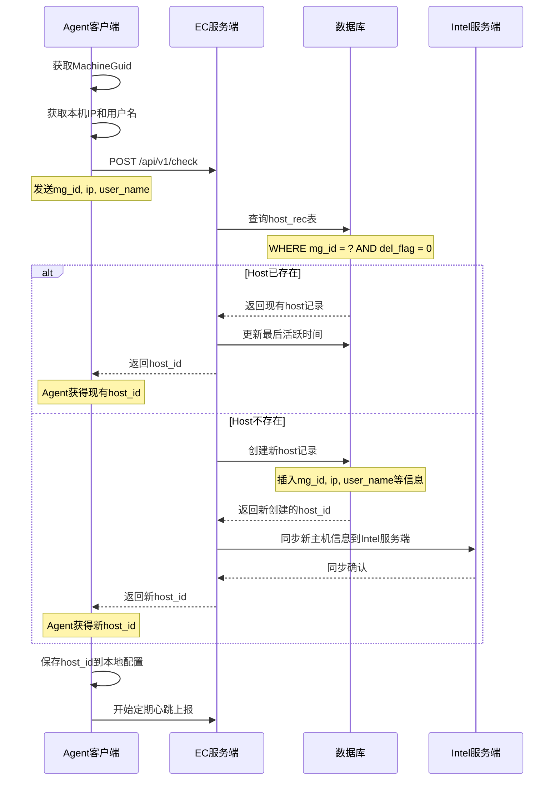
```mermaid
sequenceDiagram
    participant Agent as Agent客户端
    participant API as EC服务端
    participant DB as 数据库
    participant ExtAPI as Intel服务端
    
    Agent->>Agent: 获取MachineGuid
    Agent->>Agent: 获取本机IP和用户名
    Agent->>API: POST /api/v1/check
    Note over Agent: 发送mg_id, ip, user_name
    
    API->>DB: 查询host_rec表
    Note over DB: WHERE mg_id = ? AND del_flag = 0
    
    alt Host已存在
        DB-->>API: 返回现有host记录
        API->>DB: 更新最后活跃时间
        API-->>Agent: 返回host_id
        Note over Agent: Agent获得现有host_id
    else Host不存在
        API->>DB: 创建新host记录
        Note over DB: 插入mg_id, ip, user_name等信息
        DB-->>API: 返回新创建的host_id
        API->>ExtAPI: 同步新主机信息到Intel服务端
        ExtAPI-->>API: 同步确认
        API-->>Agent: 返回新host_id
        Note over Agent: Agent获得新host_id
    end
    
    Agent->>Agent: 保存host_id到本地配置
    Agent->>API: 开始定期心跳上报
```

**请求参数**：

```json
{
    "mg_id": "b57035cd-d8ed-4a04-a0c7-21262d933c03",
    "ip": "192.168.101.118",
    "user_name": "testuser"
}
```

**请求字段说明**：

- `mg_id`: 机器唯一标识符 (MachineGuid)
- `ip`: 主机IP地址
- `user_name`: 主机登录用户名

**响应格式**：

```json
{
    "id": "1852278641262084097"
}
```

**响应字段说明**：

- `id`: 主机ID

#### 5.3.3 上报硬件信息

**接口地址**：`/api/v1/agent/hardware/report`  
**请求方法**：`POST`  
**功能描述**：Agent 上报主机硬件信息，系统会自动检测硬件变更

**认证要求**：

- 需要在 `Authorization` 头中提供有效的 JWT token
- Token 格式：`Bearer <token>`
- Token 中的 `user_id` 字段将作为 `host_id` 使用

**请求参数**：

```json
{
  "name": "Agent Hardware Config",
  "dmr_config": {
    "revision": 1,
    "mainboard": {
      "revision": 1,
      "board": {
        "board_meta_data": {
          "host_name": "MyHost001",
          "serial_number": "SN12345"
        }
      }
    }
  },
  "type": 0,
  "updated_by": "agent@intel.com",
  "tags": ["alive", "checked"]
}
```

**请求字段说明**：

- `dmr_config`: DMR硬件配置（必需），必须包含 `revision` 字段
- `name`: 配置名称（可选）
- `type`: 上报类型（可选，默认为 `0`）
  - `0`: 正常上报，走正常对比逻辑
  - `1`: 异常上报，直接设置 `diff_state=3`
- `updated_by`: 更新者（可选）
- `tags`: 标签列表（可选）

**业务逻辑**：

1. Agent收集并上报硬件信息
2. Server接收数据并进行格式验证（基于硬件模板）
3. 提取硬件版本号（`dmr_config.revision`）与当前生效硬件版本对比
4. 使用 JSON 深度对比工具对比硬件内容变化
5. 根据变更类型记录到 `host_hw_rec` 表：
   - `diff_state=1`: 版本号变化
   - `diff_state=2`: 内容变化
   - `diff_state=3`: 异常上报
6. 更新 `host_rec` 表状态（`host_state=6`, `appr_state=2`）
7. 等待管理员审核

**Redis 使用**：

- 本接口不直接使用 Redis
- 硬件模板配置可通过 Redis 缓存（未来优化）

**时序图**：

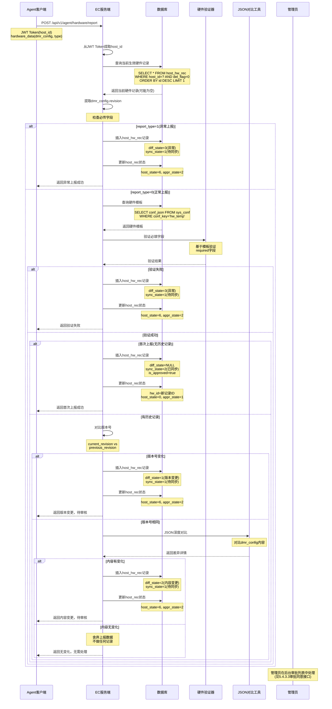
```mermaid
sequenceDiagram
    participant Agent as Agent客户端
    participant API as EC服务端
    participant DB as 数据库
    participant Validator as 硬件验证器
    participant Comparator as JSON对比工具
    participant Admin as 管理员
    
    Agent->>API: POST /api/v1/agent/hardware/report
    Note over Agent: JWT Token(host_id)<br/>hardware_data(dmr_config, type)
    
    API->>API: 从JWT Token提取host_id
    API->>DB: 查询当前生效硬件记录
    Note over DB: SELECT * FROM host_hw_rec<br/>WHERE host_id=? AND del_flag=0<br/>ORDER BY id DESC LIMIT 1
    DB-->>API: 返回当前硬件记录(可能为空)
    
    API->>API: 提取dmr_config.revision
    Note over API: 检查必传字段
    
    alt report_type=1(异常上报)
        API->>DB: 插入host_hw_rec记录
        Note over DB: diff_state=3(异常)<br/>sync_state=1(待同步)
        API->>DB: 更新host_rec状态
        Note over DB: host_state=6, appr_state=2
        API-->>Agent: 返回异常上报成功
    else report_type=0(正常上报)
        API->>DB: 查询硬件模板
        Note over DB: SELECT conf_json FROM sys_conf<br/>WHERE conf_key='hw_temp'
        DB-->>API: 返回硬件模板
        
        API->>Validator: 验证必填字段
        Note over Validator: 基于模板验证<br/>required字段
        Validator-->>API: 验证结果
        
        alt 验证失败
            API->>DB: 插入host_hw_rec记录
            Note over DB: diff_state=3(异常)<br/>sync_state=1(待同步)
            API->>DB: 更新host_rec状态
            Note over DB: host_state=6, appr_state=2
            API-->>Agent: 返回验证失败
        else 验证成功
            alt 首次上报(无历史记录)
                API->>DB: 插入host_hw_rec记录
                Note over DB: diff_state=NULL<br/>sync_state=2(已同步)<br/>is_approved=true
                API->>DB: 更新host_rec状态
                Note over DB: hw_id=新记录ID<br/>host_state=0, appr_state=1
                API-->>Agent: 返回首次上报成功
            else 有历史记录
                API->>API: 对比版本号
                Note over API: current_revision vs<br/>previous_revision
                
                alt 版本号变化
                    API->>DB: 插入host_hw_rec记录
                    Note over DB: diff_state=1(版本变更)<br/>sync_state=1(待同步)
                    API->>DB: 更新host_rec状态
                    Note over DB: host_state=6, appr_state=2
                    API-->>Agent: 返回版本变更，待审核
                else 版本号相同
                    API->>Comparator: JSON深度对比
                    Note over Comparator: 对比dmr_config内容
                    Comparator-->>API: 返回差异详情
                    
                    alt 内容有变化
                        API->>DB: 插入host_hw_rec记录
                        Note over DB: diff_state=2(内容变更)<br/>sync_state=1(待同步)
                        API->>DB: 更新host_rec状态
                        Note over DB: host_state=6, appr_state=2
                        API-->>Agent: 返回内容变更，待审核
                    else 内容无变化
                        Note over API: 舍弃上报数据<br/>不做任何记录
                        API-->>Agent: 返回无变化，无需处理
                    end
                end
            end
        end
    end
    
    Note over Admin: 管理员在后台审批列表中处理<br/>(见5.4.3.3审批同意接口)
```

**响应格式**：

```json
{
    "code": 200,
    "message": "硬件信息上报成功",
    "data": {
        "host_id": "1852278641262084097",
        "diff_state": 1,
        "sync_state": 1,
        "need_approval": true
    }
}
```

**响应字段说明**：

- `code`: 状态码，`200` 表示成功
- `message`: 响应消息
- `data`: 业务数据
  - `host_id`: 主机ID（从 JWT token 中提取）
  - `diff_state`: 差异状态，`1`-版本变更，`2`-内容变更，`3`-异常，`null`-无变化
  - `sync_state`: 同步状态，`1`-待同步，`2`-已同步
  - `need_approval`: 是否需要审批

#### 5.3.4 连接状态上报

**接口地址**：`/api/v1/rpt`  
**请求方法**：`POST`  
**功能描述**：上报主机连接状态

**请求参数**：

```json
{
    "host_id": "1852278641262084097",
    "state": 1
}
```

**请求字段说明**：

- `host_id`: 主机ID
- `state`: 连接状态

**响应格式**：

```json
{
    "code": "200",
    "message": "ok"
}
```

**响应字段说明**：

- `code`: 状态码
- `message`: 响应消息

#### 5.3.5 Case结果上报

**接口地址**：`/api/v1/agent/testcase/report`  
**请求方法**：`POST`  
**功能描述**：Agent 上报测试用例执行结果，系统会更新执行日志记录

**认证要求**：

- 需要在 `Authorization` 头中提供有效的 JWT token
- Token 格式：`Bearer <token>`
- Token 中的 `user_id` 字段将作为 `host_id` 使用

**请求参数**：

```json
{
    "tc_id": "1852278641262084097",
    "state": 2,
    "result_msg": "测试执行成功",
    "log_url": "https://example.com/logs/test_123.log"
}
```

**请求字段说明**：

- `tc_id`: 测试用例ID（必需）
- `state`: 执行状态（必需）；`0`-空闲，`1`-启动，`2`-成功，`3`-失败
- `result_msg`: 结果消息（可选）
- `log_url`: 日志文件URL（可选）

**响应格式**：

```json
{
    "code": 200,
    "message": "测试用例结果上报成功",
    "data": {
        "host_id": "1852278641262084097",
        "tc_id": "1852278641262084097",
        "state": 2,
        "updated": true
    }
}
```

**响应字段说明**：

- `code`: 状态码，`200` 表示成功
- `message`: 响应消息
- `data`: 业务数据
  - `host_id`: 主机ID（从 JWT token 中提取）
  - `tc_id`: 测试用例ID
  - `state`: 执行状态
  - `updated`: 是否更新成功

**业务逻辑**：

1. 从 JWT token 中提取 `host_id`
2. 根据 `host_id` 和 `tc_id` 查询 `host_exec_log` 表最新一条记录
3. 更新 `case_state`、`result_msg` 和 `log_url` 字段
4. 返回更新结果

#### 5.3.6 更新结果通知

**接口地址**：`/api/v1/upd`  
**请求方法**：`POST`  
**功能描述**：上报软件更新结果

**请求参数**：

```json
{
    "id": "1852278641262084097",
    "biz_key": "agent",
    "biz_ver": "dev_1.0.0",
    "biz_state": "1"
}
```

**请求字段说明**：

- `id`: 主机ID
- `biz_key`: 业务组件标识
- `biz_ver`: 更新版本号
- `biz_state`: 更新状态 (1:更新中, 2:成功, 3:失败)

**响应格式**：

```json
{
    "code": "200",
    "message": "ok"
}
```

**响应字段说明**：

- `code`: 状态码
- `message`: 响应消息

#### 5.3.7 WebSocket接口

**Case执行参数下发**：

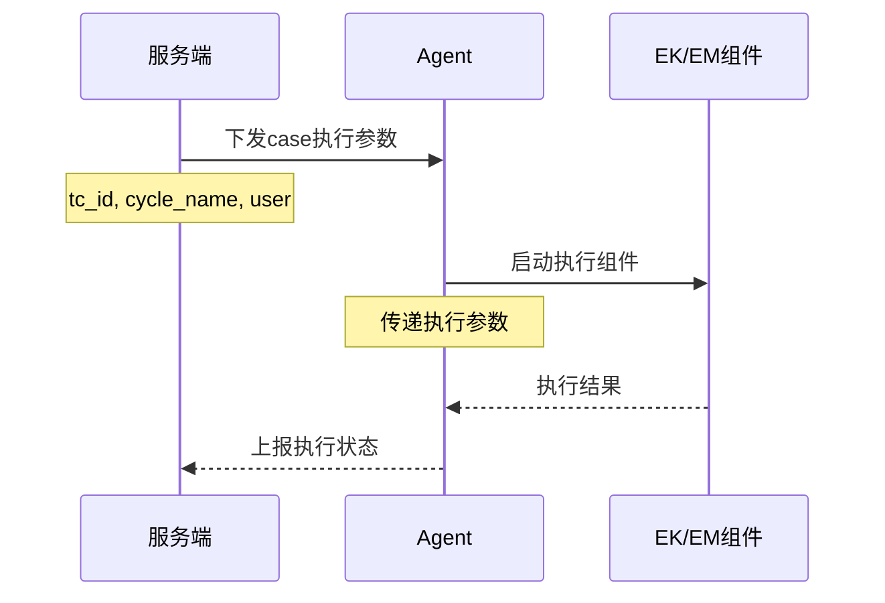
```mermaid
sequenceDiagram
    participant Server as 服务端
    participant Agent as Agent
    participant EK_EM as EK/EM组件
    
    Server->>Agent: 下发case执行参数
    Note over Server: tc_id, cycle_name, user
    Agent->>EK_EM: 启动执行组件
    Note over Agent: 传递执行参数
    EK_EM-->>Agent: 执行结果
    Agent-->>Server: 上报执行状态
```

**下发参数**:

- `type`: 消息类型 case_param
- `tc_id`: 对应 tc_id
- `cycle_name`: 对应 test_cycle_name
- `user`: 对应 user

**更新下发**：

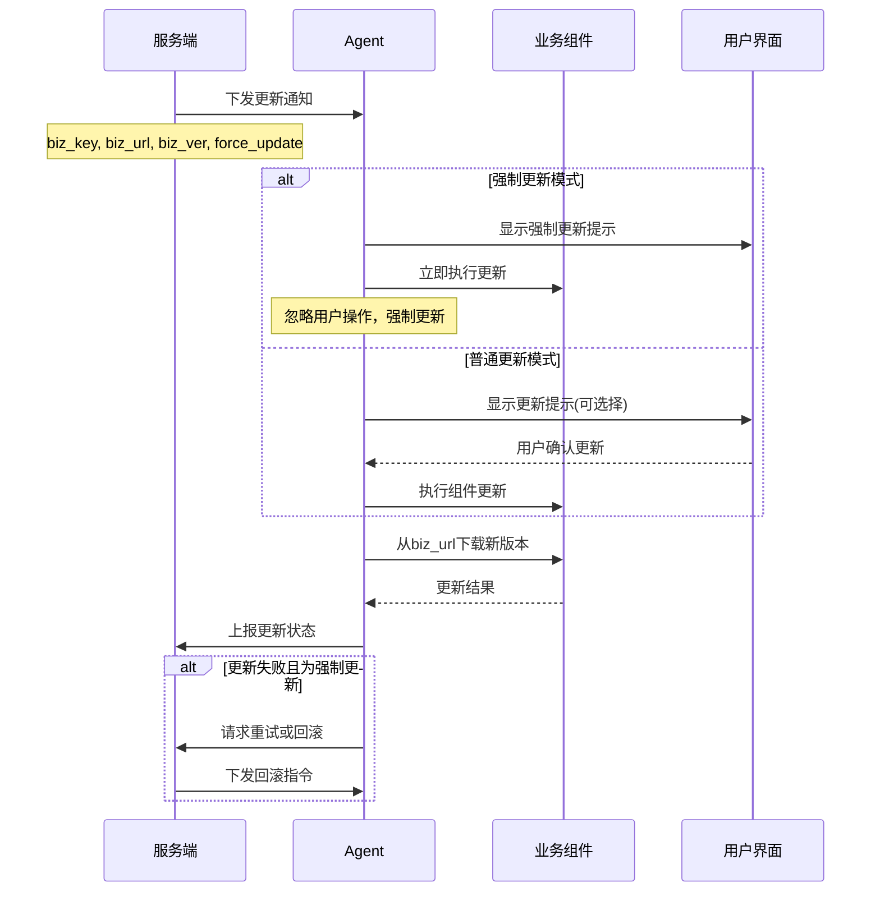
```mermaid
sequenceDiagram
    participant Server as 服务端
    participant Agent as Agent
    participant Component as 业务组件
    participant User as 用户界面
    
    Server->>Agent: 下发更新通知
    Note over Server: biz_key, biz_url, biz_ver, force_update
    
    alt 强制更新模式
        Agent->>User: 显示强制更新提示
        Agent->>Component: 立即执行更新
        Note over Agent: 忽略用户操作，强制更新
    else 普通更新模式
        Agent->>User: 显示更新提示(可选择)
        User-->>Agent: 用户确认更新
        Agent->>Component: 执行组件更新
    end
    
    Agent->>Component: 从biz_url下载新版本
    Component-->>Agent: 更新结果
    Agent->>Server: 上报更新状态
    
    alt 更新失败且为强制更新
        Agent->>Server: 请求重试或回滚
        Server->>Agent: 下发回滚指令
    end
```

**下发参数**:

- `type`: 消息类型 upd_app
- `biz_key`: 服务 key
- `biz_url`: 更新地址
- `biz_ver`: 更新版本号
- `force_update`: 是否强制更新 (true/false)
- `update_desc`: 更新描述信息
- `rollback_url`: 回滚包地址(强制更新时必填)

### 5.4 管理后台接口

#### 5.4.1 UI


#### 5.4.2 HOST管理

##### 5.4.2.1 HOST列表查询

**接口地址**：`/api/admin/v1/host`  
**请求方法**：`GET`  
**功能描述**：查询主机列表，支持分页和筛选

**请求参数**：

- `page`: 页码 (可选)
- `page_size`: 每页数量 (可选)
- `host_state`: 主机状态 (可选)
- `username`: 用户名 (可选)

**请求示例**：

```
GET /api/admin/v1/host?page=1&page_size=20&host_state=0&username=testuser
```

**响应格式**：

```json
{
    "code":"200",
    "message":"ok",
    "data": [
        {
            "id":"123445566",
            "user_name":"abc@intel.com",
            "mg_id":"b57035cd-d8ed-4a04-a0c7-21262d933c03",
            "mac":"00-E0-1C-72-FB-AA",
            "use_by": "Jon",
            "host_state":"1"
        }
    ],
    "pagination":{
        "page":"当前页码",
        "page_size":"每页数量",
        "total":"总记录数",
        "total_pages":"总页数"
    }
}
```

**响应字段说明**：

- `data`: 主机列表数据
  - `id`: 主机ID
  - `user_name`: 用户名
  - `mg_id`: 机器唯一标识符
  - `mac`: MAC地址
  - `use_by`: 使用者
  - `host_state`: 主机状态
- `pagination`: 分页信息

##### 5.4.2.2 HOST删除接口

**接口地址**：`/api/admin/v1/host`  
**请求方法**：`DELETE`  
**功能描述**：删除主机记录

**业务逻辑**：

1. 逻辑删除 `host_rec` 数据（`del_flag=1`）
2. 逻辑删除 `host_hw_rec` 数据（`del_flag=1`）
3. 调用外部硬件接口删除硬件：DELETE `/api/v1/hardware/{hardware_id}`
4. 如果外部接口调用失败，抛出异常（不删除本地数据）

**Redis 使用**：

- **外部 API Token 缓存**：调用外部硬件接口前，自动获取并缓存 Token
  - 缓存键：`external_api_token:{user_email}`
  - 过期时间：根据外部 API 返回的 `expires_in` 字段

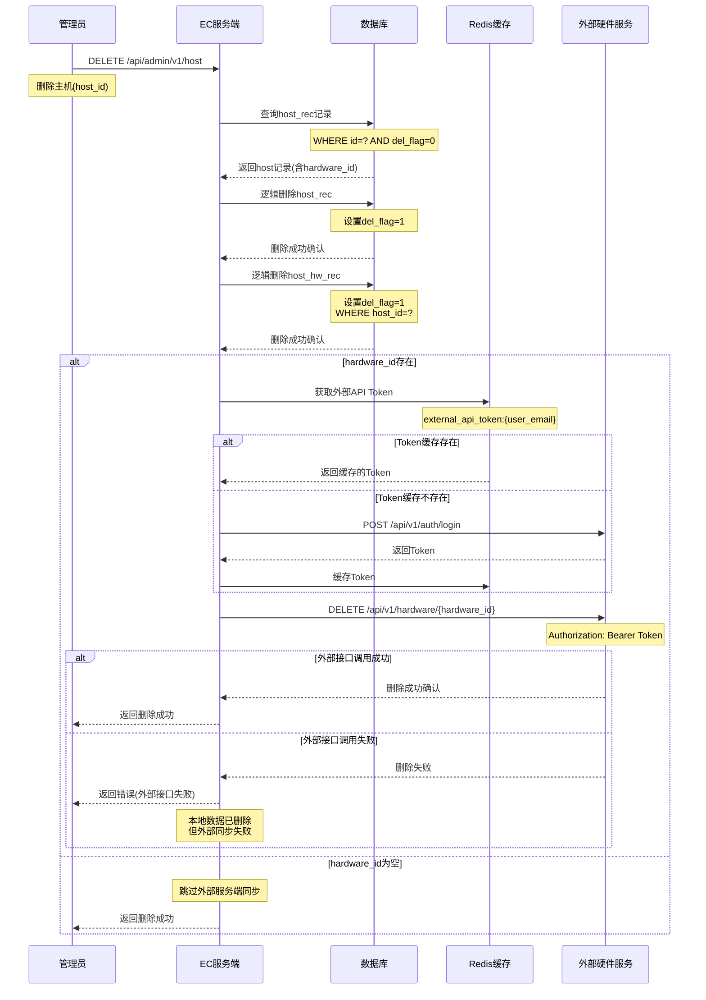
```mermaid
sequenceDiagram
    participant Admin as 管理员
    participant API as EC服务端
    participant DB as 数据库
    participant Redis as Redis缓存
    participant ExtAPI as 外部硬件服务
    
    Admin->>API: DELETE /api/admin/v1/host
    Note over Admin: 删除主机(host_id)
    
    API->>DB: 查询host_rec记录
    Note over DB: WHERE id=? AND del_flag=0
    DB-->>API: 返回host记录(含hardware_id)
    
    API->>DB: 逻辑删除host_rec
    Note over DB: 设置del_flag=1
    DB-->>API: 删除成功确认
    
    API->>DB: 逻辑删除host_hw_rec
    Note over DB: 设置del_flag=1<br/>WHERE host_id=?
    DB-->>API: 删除成功确认
    
    alt hardware_id存在
        API->>Redis: 获取外部API Token
        Note over Redis: external_api_token:{user_email}
        alt Token缓存存在
            Redis-->>API: 返回缓存的Token
        else Token缓存不存在
            API->>ExtAPI: POST /api/v1/auth/login
            ExtAPI-->>API: 返回Token
            API->>Redis: 缓存Token
        end
        
        API->>ExtAPI: DELETE /api/v1/hardware/{hardware_id}
        Note over ExtAPI: Authorization: Bearer Token
        alt 外部接口调用成功
            ExtAPI-->>API: 删除成功确认
            API-->>Admin: 返回删除成功
        else 外部接口调用失败
            ExtAPI-->>API: 删除失败
            API-->>Admin: 返回错误(外部接口失败)
            Note over API: 本地数据已删除<br/>但外部同步失败
        end
    else hardware_id为空
        Note over API: 跳过外部服务端同步
        API-->>Admin: 返回删除成功
    end
```

**请求参数**：

```json
{
    "id": "1852278641262084097"
}
```

**请求字段说明**：

- `id`: 主机ID

##### 5.4.2.3 HOST强制下线

**接口地址**：`/api/admin/v1/host/down`  
**请求方法**：`POST`  
**功能描述**：强制主机下线

**业务逻辑**：

1. 修改 `host_rec` 状态
2. 通知 `agent`

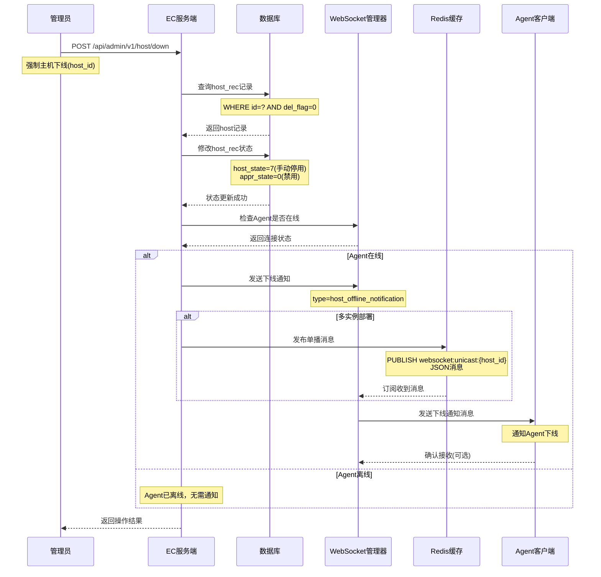
```mermaid
sequenceDiagram
    participant Admin as 管理员
    participant API as EC服务端
    participant DB as 数据库
    participant WSManager as WebSocket管理器
    participant Redis as Redis缓存
    participant Agent as Agent客户端
    
    Admin->>API: POST /api/admin/v1/host/down
    Note over Admin: 强制主机下线(host_id)
    
    API->>DB: 查询host_rec记录
    Note over DB: WHERE id=? AND del_flag=0
    DB-->>API: 返回host记录
    
    API->>DB: 修改host_rec状态
    Note over DB: host_state=7(手动停用)<br/>appr_state=0(禁用)
    DB-->>API: 状态更新成功
    
    API->>WSManager: 检查Agent是否在线
    WSManager-->>API: 返回连接状态
    
    alt Agent在线
        API->>WSManager: 发送下线通知
        Note over WSManager: type=host_offline_notification
        
        alt 多实例部署
            API->>Redis: 发布单播消息
            Note over Redis: PUBLISH websocket:unicast:{host_id}<br/>JSON消息
            Redis-->>WSManager: 订阅收到消息
        end
        
        WSManager->>Agent: 发送下线通知消息
        Note over Agent: 通知Agent下线
        Agent-->>WSManager: 确认接收(可选)
    else Agent离线
        Note over API: Agent已离线，无需通知
    end
    
    API-->>Admin: 返回操作结果
```

##### 5.4.2.4 HOST详情

**接口地址**：`/api/admin/v1/host/info`  
**请求方法**：`GET`  
**功能描述**：获取主机详细信息

**请求参数**：

- `id`: 主机ID

**请求示例**：

```
GET /api/admin/v1/host/info?id=1852278641262084097
```

**响应格式**：

```json
{
    "id":"123455",
    "mg_id":"b57035cd-d8ed-4a04-a0c7-21262d933c03",
    "mac":"00-E0-1C-72-FB-AA",
    "ip":"192.168.121.1",
    "username":"test@intel.com",
    "***REMOVED***word":"--",
    "port":"3390",
    "hw_list": [
        {
            "hw_id":"123123",
            "created_time": "1015-09-01",
            "hw_info": "...."
        }
    ]
}
```

**响应字段说明**：

- `id`: 主机ID
- `mg_id`: 机器唯一标识符
- `mac`: MAC地址
- `ip`: IP地址
- `username`: 用户名
- `***REMOVED***word`: 密码
- `port`: 端口
- `hw_list`: 硬件信息列表

##### 5.4.2.5 HOST执行日志

**接口地址**：`/api/admin/v1/host/list/log`  
**请求方法**：`GET`  
**功能描述**：获取主机执行日志列表

**请求参数**：

- `id`: 主机ID
- `page`: 页码 (可选)
- `page_size`: 每页数量 (可选)

**请求示例**：

```
GET /api/admin/v1/host/list/log?id=1852278641262084097&page=1&page_size=20
```

**响应格式**:

```json
{
    "code":"200",
    "message":"ok",
    "data": [
        {
            "id":"123445566",
            "exec_date":"2025-01-01",
            "exec_time":"12:00:00",
            "tc_id":"12312343w52",
            "use_by": "Jon",
            "state":"1",
            "remak":"备注"
        }
    ],
    "pagination":{
        "page":"当前页码",
        "page_size":"每页数量",
        "total":"总记录数",
        "total_pages":"总页数"
    }
}
```

#### 5.4.3 主机审批

##### 5.4.3.1 待审批列表

**接口地址**：`/api/admin/v1/host/appr`  
**请求方法**：`GET`  
**功能描述**：获取待审批主机列表

**请求参数**：

- `page`: 页码 (可选)
- `page_size`: 每页数量 (可选)
- `host_state`: 主机状态 (可选)

**请求示例**：

```
GET /api/admin/v1/host/appr?page=1&page_size=20&host_state=6
```

**响应格式**：

```json
{
    "code":"200",
    "message":"ok",
    "data": [
        {
            "id":"123445566",
            "mg_id":"b57035cd-d8ed-4a04-a0c7-21262d933c03",
            "mac":"00-E0-1C-72-FB-AA",
            "state": "1",
            "apply_time":"1"
        }
    ],
    "pagination":{
        "page":"当前页码",
        "page_size":"每页数量",
        "total":"总记录数",
        "total_pages":"总页数"
    }
}
```

**响应字段说明**：

- `data`: 审批列表数据
  - `id`: 主机ID
  - `mg_id`: 机器唯一标识符
  - `mac`: MAC地址
  - `state`: 审批状态
  - `apply_time`: 申请时间
- `pagination`: 分页信息

##### 5.4.3.2 审批删除

**接口地址**：`/api/admin/v1/host/appr`  
**请求方法**：`DELETE`  
**功能描述**：删除审批申请

**业务逻辑**：

1. 逻辑删除 `host_rec` 数据（`del_flag=1`）
2. 逻辑删除 `host_hw_rec` 数据（`del_flag=1`）
3. 如果 `hardware_id` 存在，调用外部硬件接口删除硬件：DELETE `/api/v1/hardware/{hardware_id}`
4. 如果外部接口调用失败，抛出异常（不删除本地数据）

**Redis 使用**：

- **外部 API Token 缓存**：调用外部硬件接口前，自动获取并缓存 Token
  - 缓存键：`external_api_token:{user_email}`
  - 过期时间：根据外部 API 返回的 `expires_in` 字段

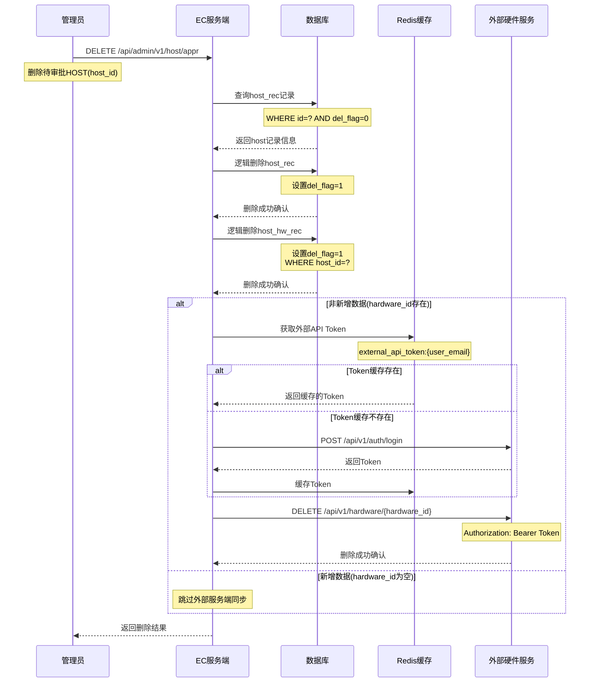
```mermaid
sequenceDiagram
    participant Admin as 管理员
    participant API as EC服务端
    participant DB as 数据库
    participant Redis as Redis缓存
    participant ExtAPI as 外部硬件服务
    
    Admin->>API: DELETE /api/admin/v1/host/appr
    Note over Admin: 删除待审批HOST(host_id)
    
    API->>DB: 查询host_rec记录
    Note over DB: WHERE id=? AND del_flag=0
    DB-->>API: 返回host记录信息
    
    API->>DB: 逻辑删除host_rec
    Note over DB: 设置del_flag=1
    DB-->>API: 删除成功确认
    
    API->>DB: 逻辑删除host_hw_rec
    Note over DB: 设置del_flag=1<br/>WHERE host_id=?
    DB-->>API: 删除成功确认
    
    alt 非新增数据(hardware_id存在)
        API->>Redis: 获取外部API Token
        Note over Redis: external_api_token:{user_email}
        alt Token缓存存在
            Redis-->>API: 返回缓存的Token
        else Token缓存不存在
            API->>ExtAPI: POST /api/v1/auth/login
            ExtAPI-->>API: 返回Token
            API->>Redis: 缓存Token
        end
        
        API->>ExtAPI: DELETE /api/v1/hardware/{hardware_id}
        Note over ExtAPI: Authorization: Bearer Token
        ExtAPI-->>API: 删除成功确认
    else 新增数据(hardware_id为空)
        Note over API: 跳过外部服务端同步
    end
    
    API-->>Admin: 返回删除结果
```

##### 5.4.3.3 审批同意

**接口地址**：`/api/admin/v1/host/appr`  
**请求方法**：`PUT`  
**功能描述**：同意审批申请

**业务逻辑**：

1. 根据 `host_ids` 查询所有 `host_hw_rec` 表 `sync_state=1`（待同步）的数据
2. 最新一条数据：`sync_state=2`（已同步），`appr_time=now()`，`appr_by=appr_by`
3. 其他数据：`sync_state=4`（已拒绝）
4. 修改 `host_rec` 表：`appr_state=1`（已启用），`host_state=0`（空闲），`hw_id=最新硬件记录ID`
5. **调用外部硬件接口**：
   - 新增硬件：POST `/api/v1/hardware/`（使用 Redis 分布式锁防止并发创建）
   - 修改硬件：PUT `/api/v1/hardware/{hardware_id}`
6. 同步成功后更新 `host_hw_rec.sync_state=2`

**Redis 使用**：

- **分布式锁**：新增硬件时使用 `hardware_create_lock:{host_id}` 锁，防止接口抖动或多节点部署造成的脏数据
  - 锁超时时间：30 秒
  - 锁值：UUID（用于安全释放）
  - 如果 Redis 不可用，记录警告但继续执行（降级处理）

**外部 API Token 缓存**：

- 调用外部硬件接口前，自动获取并缓存 Token
- 缓存键：`external_api_token:{user_email}`
- 过期时间：根据外部 API 返回的 `expires_in` 字段（默认约 180 天）

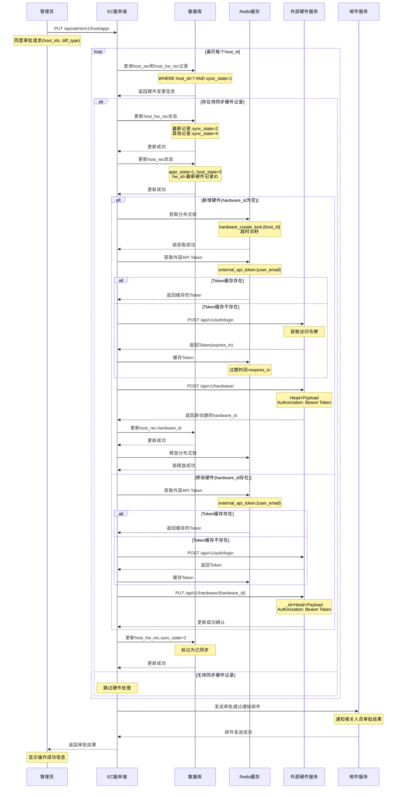
```mermaid
sequenceDiagram
    participant Admin as 管理员
    participant API as EC服务端
    participant DB as 数据库
    participant Redis as Redis缓存
    participant ExtAPI as 外部硬件服务
    participant Email as 邮件服务
    
    Admin->>API: PUT /api/admin/v1/host/appr
    Note over Admin: 同意审批请求(host_ids, diff_type)
    
    loop 遍历每个host_id
        API->>DB: 查询host_rec和host_hw_rec记录
        Note over DB: WHERE host_id=? AND sync_state=1
        DB-->>API: 返回硬件变更信息
        
        alt 存在待同步硬件记录
            API->>DB: 更新host_hw_rec状态
            Note over DB: 最新记录:sync_state=2<br/>其他记录:sync_state=4
            DB-->>API: 更新成功
            
            API->>DB: 更新host_rec状态
            Note over DB: appr_state=1, host_state=0<br/>hw_id=最新硬件记录ID
            DB-->>API: 更新成功
            
            alt 新增硬件(hardware_id为空)
                API->>Redis: 获取分布式锁
                Note over Redis: hardware_create_lock:{host_id}<br/>超时30秒
                Redis-->>API: 锁获取成功
                
                API->>Redis: 获取外部API Token
                Note over Redis: external_api_token:{user_email}
                alt Token缓存存在
                    Redis-->>API: 返回缓存的Token
                else Token缓存不存在
                    API->>ExtAPI: POST /api/v1/auth/login
                    Note over ExtAPI: 获取访问令牌
                    ExtAPI-->>API: 返回Token(expires_in)
                    API->>Redis: 缓存Token
                    Note over Redis: 过期时间=expires_in
                end
                
                API->>ExtAPI: POST /api/v1/hardware/
                Note over ExtAPI: Head+Payload<br/>Authorization: Bearer Token
                ExtAPI-->>API: 返回新创建的hardware_id
                
                API->>DB: 更新host_rec.hardware_id
                DB-->>API: 更新成功
                
                API->>Redis: 释放分布式锁
                Redis-->>API: 锁释放成功
            else 修改硬件(hardware_id存在)
                API->>Redis: 获取外部API Token
                Note over Redis: external_api_token:{user_email}
                alt Token缓存存在
                    Redis-->>API: 返回缓存的Token
                else Token缓存不存在
                    API->>ExtAPI: POST /api/v1/auth/login
                    ExtAPI-->>API: 返回Token
                    API->>Redis: 缓存Token
                end
                
                API->>ExtAPI: PUT /api/v1/hardware/{hardware_id}
                Note over ExtAPI: _id+Head+Payload<br/>Authorization: Bearer Token
                ExtAPI-->>API: 更新成功确认
            end
            
            API->>DB: 更新host_hw_rec.sync_state=2
            Note over DB: 标记为已同步
            DB-->>API: 更新成功
        else 无待同步硬件记录
            Note over API: 跳过硬件处理
        end
    end
    
    API->>Email: 发送审批通过通知邮件
    Note over Email: 通知相关人员审批结果
    Email-->>API: 邮件发送成功
    
    API-->>Admin: 返回审批结果
    Note over Admin: 显示操作成功信息
```

##### 5.4.3.4 查看详情

**接口地址**：`/api/admin/v1/host/appr/info`  
**请求方法**：`GET`  
**功能描述**：查看审批申请详情

**请求参数**：

- `id`: 主机ID

**请求示例**：

```
GET /api/admin/v1/host/appr/info?id=1852278641262084097
```

##### 5.4.3.5 维护通知邮件

**接口地址**：`/api/admin/v1/host/appr/notify`  
**请求方法**：`POST`  
**功能描述**：发送维护通知邮件

**请求参数**：

```json
{
    "email": "admin@intel.com"
}
```

**请求字段说明**：

- `email`: 接收邮件地址

#### 5.4.4 OTA管理

##### 5.4.4.1 获取OTA配置列表

**接口地址**：`/api/admin/v1/ota`  
**请求方法**：`GET`  
**功能描述**：获取OTA配置列表

**请求示例**：

```
GET /api/admin/v1/ota
```

**响应格式**：

```json
[
    {
        "id":"123",
        "biz_key":"agent",
        "biz_ver":"1.0",
        "biz_url":"https://intel.com/123123.whl"
    }
]
```

**响应字段说明**：

- `id`: 配置ID
- `biz_key`: 业务组件标识
- `biz_ver`: 版本号
- `biz_url`: 下载地址

##### 5.4.4.2 下发OTA配置

**接口地址**：`/api/admin/v1/ota`  
**请求方法**：`POST`  
**功能描述**：下发OTA更新配置

**业务逻辑**：

1. 更新 `sys_conf` 表：根据 `id` 更新 `conf_ver`, `conf_name`, `conf_json`
2. 通过 WebSocket 广播消息到所有连接的 Agent：
   - 消息类型：`upd_app`
   - 包含：`biz_key`, `biz_ver`, `biz_url`, `conf_md5`, `force_update`
3. 使用 Redis Pub/Sub 实现跨实例广播（如果部署多个实例）

**Redis 使用**：

- **WebSocket 跨实例广播**：通过 Redis Pub/Sub 频道 `websocket:broadcast` 实现
  - 所有实例订阅该频道
  - 收到消息后广播给本地连接的 Agent
  - 确保多实例部署时所有 Agent 都能收到更新通知

```mermaid
sequenceDiagram
    participant Admin as 管理员
    participant API as EC服务端
    participant DB as 数据库
    participant Redis as Redis缓存
    participant WSManager as WebSocket管理器
    participant Agent as Agent群组
    
    Admin->>API: POST /api/admin/v1/ota
    Note over Admin: 提交OTA配置<br/>(config_id, conf_ver, conf_name, conf_url, conf_md5)
    
    API->>DB: 查询sys_conf配置
    Note over DB: WHERE id=? AND del_flag=0
    DB-->>API: 返回配置记录
    
    API->>DB: 更新sys_conf表
    Note over DB: conf_ver, conf_name, conf_json<br/>(conf_url, conf_md5)
    DB-->>API: 更新成功
    
    API->>WSManager: 构建OTA更新消息
    Note over WSManager: type=upd_app<br/>biz_key, biz_ver, biz_url, conf_md5, force_update
    
    alt 多实例部署
        API->>Redis: 发布广播消息
        Note over Redis: PUBLISH websocket:broadcast<br/>JSON消息
        Redis-->>API: 发布成功
        
        loop 所有实例
            Redis->>WSManager: 订阅收到消息
            WSManager->>Agent: 广播给本地连接
            Note over Agent: 所有连接的Agent接收
        end
    else 单实例部署
        WSManager->>Agent: 直接广播给本地连接
        Note over Agent: 所有连接的Agent接收
    end
    
    Agent-->>WSManager: 确认接收(可选)
    API-->>Admin: 返回下发结果
    Note over Admin: broadcast_count:成功发送数量
```

**请求参数**：

```json
{
    "biz_key": "agent",
    "biz_ver": "2.0.1",
    "biz_url": "https://intel.com/agent_v2.0.1.whl",
    "force_update": true
}
```

**请求字段说明**：

- `biz_key`: 业务组件标识
- `biz_ver`: 更新版本号
- `biz_url`: 更新包下载地址
- `force_update`: 是否强制更新

**响应格式**：

```json
{
    "code": "200",
    "message": "ok"
}
```

**响应字段说明**：

- `code`: 状态码
- `message`: 响应消息

---

## 6. Redis 使用

### 6.1 外部 API Token 缓存

**使用场景**：调用外部硬件接口时，需要先获取访问令牌（Token）

**缓存键格式**：`external_api_token:{user_email}`

**过期时间**：根据外部 API 返回的 `expires_in` 字段动态设置（默认约 180 天）

**业务逻辑**：

1. 根据 `user_id` 查询 `sys_user` 表获取用户邮箱
2. 先从 Redis 缓存获取 token
3. 如果缓存为空，使用 `asyncio.Lock()` 防止并发请求
4. 调用外部登录接口获取 token
5. 根据 `expires_in` 将 token 存入 Redis 缓存
6. 返回完整的 token 信息

**使用接口**：

- `services/host-service/app/services/external_api_client.py::get_external_api_token()`
- 自动在调用外部硬件接口时使用

**相关接口**：

- 审批同意接口（`/api/admin/v1/host/appr`）
- 主机删除接口（`/api/admin/v1/host`）

---

### 6.2 Token 黑名单

#### 6.2.1 Refresh Token 黑名单

**使用场景**：用户刷新 access_token 时，将旧的 refresh_token 加入黑名单

**缓存键格式**：`refresh_token_blacklist:{refresh_token}`

**过期时间**：refresh_token 的剩余有效期（TTL，动态计算）

**业务逻辑**：

- 当用户使用 refresh_token 刷新 access_token 时，将旧的 refresh_token 加入黑名单
- 防止 refresh_token 被重复使用（防止重放攻击）
- 过期时间设置为 refresh_token 的剩余有效期

**使用接口**：

- `services/auth-service/app/services/auth_service.py::refresh_access_token()`

#### 6.2.2 Access Token 黑名单

**使用场景**：用户登出时，将 access_token 加入黑名单

**缓存键格式**：`token_blacklist:{access_token}`

**过期时间**：access_token 的剩余有效期（TTL，动态计算）

**业务逻辑**：

- 用户登出时，将 access_token 加入黑名单
- 在验证 token 时检查是否在黑名单中
- 如果 Redis 连接失败，为了安全起见拒绝验证

**使用接口**：

- `services/auth-service/app/services/auth_service.py::logout()`

---

### 6.3 系统配置缓存

#### 6.3.1 Case 超时配置缓存

**使用场景**：Case 超时检测定时任务需要频繁查询超时配置

**缓存键格式**：`sys_conf:case_timeout`

**过期时间**：1 小时（3600 秒）

**业务逻辑**：

1. 定时任务执行时，先从 Redis 缓存获取配置
2. 如果缓存为空，从 `sys_conf` 表查询
3. 将配置存入 Redis 缓存（1 小时过期）
4. 返回配置值

**使用接口**：

- `services/host-service/app/services/case_timeout_task.py::_get_case_timeout_config()`

---

### 6.4 WebSocket 跨实例通信

#### 6.4.1 广播消息

**使用场景**：当部署多个 `host-service` 实例时，需要向所有连接的 Agent 广播消息

**Redis 频道**：`websocket:broadcast`

**业务逻辑**：

1. 发送方：通过 `redis_manager.client.publish()` 发布消息到 `websocket:broadcast` 频道
2. 接收方：所有实例订阅该频道，收到消息后广播给本地连接的 Agent
3. 消息格式：JSON 字符串，包含消息类型和内容

**使用接口**：

- `services/host-service/app/services/agent_websocket_manager.py::broadcast_message()`
- OTA 配置下发接口（`/api/admin/v1/ota`）

#### 6.4.2 单播消息

**使用场景**：向指定 Host 发送消息（如下线通知）

**Redis 频道模式**：`websocket:unicast:{host_id}`

**业务逻辑**：

1. 发送方：通过 `redis_manager.client.publish()` 发布消息到 `websocket:unicast:{host_id}` 频道
2. 接收方：所有实例订阅该模式（`websocket:unicast:*`），收到消息后检查本地是否有连接并发送
3. 如果本地没有连接，消息会被忽略

**使用接口**：

- `services/host-service/app/services/agent_websocket_manager.py::send_to_host()`

---

### 6.5 分布式锁

#### 6.5.1 硬件创建分布式锁

**使用场景**：防止接口抖动或多节点部署时，同一主机并发创建多个硬件记录

**锁键格式**：`hardware_create_lock:{host_id}`

**锁超时时间**：30 秒

**业务逻辑**：

1. 在调用外部硬件接口创建新硬件记录之前，尝试获取分布式锁
2. 锁基于 `host_id`，确保同一主机不会并发创建多个硬件记录
3. 如果 Redis 不可用，记录警告并继续执行（降级处理）
4. 如果锁已被其他实例持有，抛出 `BusinessError` (HTTP 409 Conflict)
5. 操作完成后，在 `finally` 块中释放锁

**使用接口**：

- `services/host-service/app/services/admin_appr_host_service.py::_call_hardware_api()`
- 审批同意接口（`/api/admin/v1/host/appr`）- 新增硬件时

**实现方式**：

- 使用 Redis `SET NX EX` 命令获取锁
- 使用 Lua 脚本原子性释放锁（检查锁值匹配）

---

## 7. 定时任务

### 7.1 Case 超时检测任务

**服务**：`host-service`

**执行间隔**：10 分钟（600 秒）

**首次执行延迟**：60 秒（服务启动后等待 60 秒再执行第一次检查）

**业务逻辑**：

1. 每 10 分钟执行一次超时检测
2. 从 `sys_conf` 表查询 `case_timeout` 配置（带 Redis 缓存，缓存 1 小时）
3. 查询超时的 `host_exec_log` 记录：
   - `host_state` in (2, 3)  # 已占用或 case 执行中
   - `case_state` = 1        # 启动
   - `del_flag` = 0          # 未删除
   - `begin_time` < 当前时间 - `case_timeout` 分钟
4. 通过 WebSocket 通知对应的 Host 结束任务

**处理的表数据**：

- `sys_conf` 表：查询 `case_timeout` 配置
- `host_exec_log` 表：查询超时的执行日志

**Redis 使用**：

- 缓存 `case_timeout` 配置：`sys_conf:case_timeout`，过期时间 1 小时

**生命周期管理**：

- 通过 FastAPI 的 `lifespan` 处理器在服务启动时自动启动
- 在服务关闭时自动停止

---

### 7.2 WebSocket 心跳检查任务

**服务**：`host-service`

**执行间隔**：10 秒

**心跳超时时间**：60 秒

**心跳警告等待时间**：10 秒

**业务逻辑**：

1. 每 10 秒批量检查所有 WebSocket 连接的心跳状态
2. 检测心跳超时的连接（超过 60 秒未收到心跳）
3. 首次超时：发送警告并记录警告时间
4. 已发送警告且超过等待时间：关闭连接

**优化机制**：

- 使用单个任务批量检查所有连接（替代每个连接独立的心跳任务）
- 500 个连接从 500 个任务减少到 1 个任务
- CPU 消耗降低 90%

**处理的表数据**：

- 无数据库表操作，仅处理内存中的连接状态

**生命周期管理**：

- 在 `AgentWebSocketManager` 初始化时自动启动

---

### 7.3 连接池管理任务

**服务**：`gateway-service`

#### 7.3.1 连接池清理任务

**执行间隔**：60 秒

**业务逻辑**：

- 每 60 秒执行一次连接池清理
- 清理非活跃连接
- 释放资源

#### 7.3.2 连接池健康检查任务

**执行间隔**：30 秒

**业务逻辑**：

- 每 30 秒执行一次健康检查
- 遍历所有连接池中的连接
- 对活跃连接执行 ping 操作
- 如果 ping 失败，标记连接为非活跃

#### 7.3.3 连接池监控任务

**执行间隔**：60 秒

**业务逻辑**：

- 每 60 秒执行一次连接池状态监控
- 获取连接池统计信息
- 记录连接池状态日志

**生命周期管理**：

- 在 `WebSocketConnectionPool` 初始化时通过 `start_background_tasks()` 启动

---

## 8. 附录

### 8.1 性能指标

**处理能力**：

- 支持500个并发用户同时操作
- 每小时处理10000次配置查询请求

**响应延迟**：

- 插件操作响应时间 < 2秒
- 配置查询响应时间 < 5秒
- 主机连接响应时间 < 3秒

### 8.2 服务器建议

**业务服务器**：

- CPU: 8核心或以上
- 内存: 16GB RAM或以上
- 存储: 500GB HD或以上
- 网络: 千兆网络接口

### 8.3 状态码定义

**主机状态 (host_state)**：

- 0: 空闲 (free)
- 2: 已占用 (occ)
- 3: case执行中 (run)
- 4: 离线 (offline)
- 5: 待激活 (inact)
- 6: 存在潜在的硬件改动 (hw_chg)
- 7: 手动停用 (disable)
- 8: 更新中 (updating)

**硬件变更状态 (diff_state)**：

- 1: 版本变更
- 2: 内容变更
- 3: 审核未通过

**执行状态**：

- 0: 成功
- 1: 失败
- 2: 超时

### 8.4 变更记录

| 版本 | 日期 | 变更内容 | 作者 |
|------|------|----------|------|
| v1.0 | 2025-09-29 | 初始版本创建 | 郗继常 |
| v1.1 | 2025-10-09 | 更新Agent客户端接口文档 | 郗继常 |
| v1.2 | 2025-10-11 | 更新Agent客户端接口文档 | 郗继常 |
| v1.3 | 2025-12-23 | 补充 Redis 使用和定时任务流程说明 | 郗继常 |
| v1.4 | 2025-12-23 | 整合 Agent 接口文档，更新 mermaid 图表和文档序号 | 郗继常 |

---

==文档结束==
