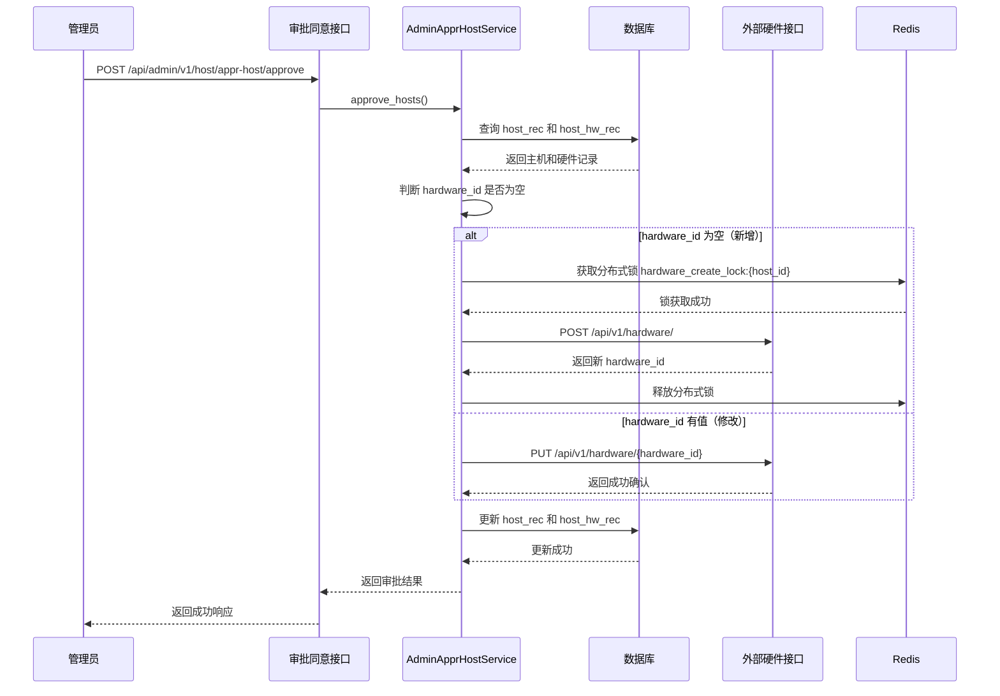

# 外部硬件新增和修改逻辑说明

## 📋 概述

本文档详细说明在主机审批同意流程中，如何调用外部硬件接口进行新增和修改操作的完整逻辑。

## 🎯 调用时机

外部硬件接口的调用发生在 **主机审批同意** 流程中，具体位置：

- **接口**: `/api/admin/v1/host/appr-host/approve`
- **服务方法**: `AdminApprHostService.approve_hosts()`
- **文件位置**: `services/host-service/app/services/admin_appr_host_service.py`

## 🔍 判断逻辑：新增 vs 修改

系统通过 `host_rec.hardware_id` 字段来判断是新增还是修改：

```python
# 判断是新增还是修改（通过 host_rec.hardware_id 是否为空）
existing_hardware_id = host_rec.hardware_id

# 调用外部硬件接口
hardware_id_result = await _call_hardware_api(
    hardware_id=existing_hardware_id,  # None = 新增，非 None = 修改
    hw_info=latest_hw_rec.hw_info,
    request=http_request,
    user_id=appr_by,
    locale=locale,
    host_id=host_id,
)
```

**判断规则**：

- **新增硬件**：`host_rec.hardware_id` 为 `None` 或空字符串
- **修改硬件**：`host_rec.hardware_id` 有值（已存在的外部硬件ID）

## 📝 完整流程

### 1. 审批同意流程入口



### 2. 新增硬件流程（详细）

#### 2.1 前置条件检查

1. **检查 Mock 模式**：
   - 如果 `USE_HARDWARE_MOCK=true`，直接返回模拟的 `hardware_id`
   - 否则继续调用真实接口

2. **检查硬件信息**：
   - 必须存在 `latest_hw_rec.hw_info`（硬件信息）
   - 如果 `hw_info` 为空，跳过外部接口调用，记录警告日志

#### 2.2 Redis 分布式锁

**目的**：防止多实例部署或接口抖动导致的并发创建脏数据

**锁机制**：

```python
# 生成锁的键：基于 host_id
lock_key = f"hardware_create_lock:{host_id}"
lock_value = str(uuid.uuid4())

# 尝试获取锁（超时时间 30 秒）
lock_acquired = await redis_manager.acquire_lock(lock_key, timeout=30, lock_value=lock_value)
```

**锁处理逻辑**：

- **Redis 不可用**：记录警告日志，继续执行（降级处理）
- **锁获取失败**：抛出 `BusinessError` (HTTP 409 Conflict)，提示"主机正在创建硬件记录，请稍后重试"
- **锁获取成功**：继续执行接口调用，在 `finally` 块中释放锁

#### 2.3 构建请求参数

**请求体结构**：

```json
{
  "Head": {
    "ConfigName": "DMR-sample-1",
    "Component": "bios.playform",
    "Owner": "zeyichen",
    "Project": "bios.oakstream_diamondrapids",
    "Environment": "silicon",
    "Milestone": "Alpha",
    "SubComponent": "",
    "Type": "hardware",
    "Tag": ""
  },
  "Payload": {
    "dmr_config": {
      "mainboard": {
        "board": {
          "board_meta_data": {
            "host_name": "Host-192.168.1.100"
          }
        }
      }
    },
    "host_ip": "192.168.1.100",
    "mg_id": "MG001"
  }
}
```

**参数说明**：

- **Head**: 固定格式的头部信息，由 `_build_hardware_head()` 函数生成
- **Payload**: 来自 `host_hw_rec.hw_info` 字段的完整硬件信息

#### 2.4 调用外部接口

**接口信息**：

- **URL**: `{HARDWARE_API_URL}/api/v1/hardware/`
- **方法**: `POST`
- **认证**: Bearer Token（自动从 `get_external_api_token()` 获取）

**调用代码**：

```python
response = await call_external_api(
    method="POST",
    url_path="/api/v1/hardware/",
    request=request,
    user_id=user_id,
    json_data=request_body,
    locale=locale,
)
```

#### 2.5 响应处理

**成功判断**：

```python
# 检查多个可能的成功标识
is_success = (
    (status_header and str(status_header) == "200")
    or (status_code and status_code == 200)
    or (body_code and body_code == 200)
)
```

**提取 hardware_id**：

```python
# 优先提取 _id 字段
new_hardware_id = response_body.get("_id")
if not new_hardware_id:
    # 如果 _id 不存在，尝试其他字段名
    new_hardware_id = response_body.get("hardware_id") or response_body.get("id")
```

**成功响应示例**：

```json
{
  "_id": "507f1f77bcf86cd799439011",
  "code": 200,
  "message": "创建成功"
}
```

#### 2.6 释放分布式锁

```python
finally:
    # 确保锁在操作完成后被释放
    if lock_key and lock_value:
        await redis_manager.release_lock(lock_key, lock_value)
```

### 3. 修改硬件流程（详细）

#### 3.1 前置条件检查

与新增流程相同，检查 Mock 模式和硬件信息。

**注意**：修改流程**不需要**分布式锁，因为是基于已有的 `hardware_id` 进行更新。

#### 3.2 构建请求参数

**请求体结构**：

```json
{
  "_id": {
    "$oid": "507f1f77bcf86cd799439011"
  },
  "Head": {
    "ConfigName": "DMR-sample-1",
    "Component": "bios.playform",
    "Owner": "zeyichen",
    "Project": "bios.oakstream_diamondrapids",
    "Environment": "silicon",
    "Milestone": "Alpha",
    "SubComponent": "",
    "Type": "hardware",
    "Tag": ""
  },
  "Payload": {
    "dmr_config": {
      "mainboard": {
        "board": {
          "board_meta_data": {
            "host_name": "Host-192.168.1.100"
          }
        }
      }
    },
    "host_ip": "192.168.1.100",
    "mg_id": "MG001"
  }
}
```

**参数说明**：

- **\_id**: MongoDB 格式的硬件ID对象，包含 `$oid` 字段
- **Head**: 与新增接口相同
- **Payload**: 与新增接口相同

#### 3.3 调用外部接口

**接口信息**：

- **URL**: `{HARDWARE_API_URL}/api/v1/hardware/{hardware_id}`
- **方法**: `PUT`
- **认证**: Bearer Token（自动获取）

**调用代码**：

```python
response = await call_external_api(
    method="PUT",
    url_path=f"/api/v1/hardware/{hardware_id}",
    request=request,
    user_id=user_id,
    json_data=request_body,
    locale=locale,
)
```

#### 3.4 响应处理

**成功判断**：与新增流程相同，检查多个可能的成功标识。

**返回值**：直接返回传入的 `hardware_id`（不提取新ID）

**成功响应示例**：

```json
{
  "code": 200,
  "message": "更新成功"
}
```

## 🔐 认证机制

所有外部硬件接口调用都需要 Bearer Token 认证：

1. **Token 获取**：
   - 根据 `user_id` 查询 `sys_user` 表获取用户邮箱
   - 从 Redis 缓存获取 token（键：`external_api_token:{user_email}`）
   - 如果缓存不存在，调用外部登录接口获取新 token

2. **Token 缓存**：
   - 缓存键：`external_api_token:{user_email}`
   - 过期时间：根据外部 API 返回的 `expires_in` 字段动态设置（默认约 180 天）

3. **请求头设置**：
   ```python
   headers = {
       "Authorization": f"{token_type} {access_token}",
       "Content-Type": "application/json",
   }
   ```

## 📊 数据库更新逻辑

### 更新时机

**重要**：只有在外部接口调用成功（或明确跳过）后，才会更新数据库。

```python
# ✅ 修复：先调用外部接口，成功后再收集需要更新的数据
hardware_id_result = await _call_hardware_api(...)

# 只有外部接口调用成功（或跳过）后，才收集需要更新的数据
latest_hw_ids_to_update.append(latest_hw_id)
```

### 更新内容

1. **host_rec 表**：
   - `appr_state`: 更新为 `APPR_STATE_ENABLE`（已启用）
   - `host_state`: 更新为 `HOST_STATE_FREE`（空闲）
   - `hardware_id`: 更新为外部接口返回的 `hardware_id`（新增时）
   - `hw_id`: 更新为最新的硬件记录ID
   - `subm_time`: 更新为当前时间

2. **host_hw_rec 表**：
   - `sync_state`: 更新为 `2`（已同步）
   - `hardware_id`: 更新为外部接口返回的 `hardware_id`（新增时）

## ⚠️ 错误处理

### 业务错误

- **锁获取失败**：HTTP 409 Conflict，提示"主机正在创建硬件记录，请稍后重试"
- **接口调用失败**：HTTP 500，包含详细的错误信息
- **响应格式错误**：HTTP 500，提示"硬件接口返回数据格式错误"

### 异常处理

```python
except BusinessError:
    # 业务错误直接抛出，不收集更新数据
    raise
except Exception as e:
    # 系统异常，记录错误日志并抛出 BusinessError
    logger.error("调用外部硬件接口失败", exc_info=True)
    raise BusinessError(...)
```

## 🔄 完整代码流程

```python
# 1. 查询主机和硬件记录
host_rec = await get_host_rec(host_id)
hw_recs = await get_hw_recs(host_id)

# 2. 获取最新硬件记录
latest_hw_rec = hw_recs[0]

# 3. 判断是新增还是修改
existing_hardware_id = host_rec.hardware_id

# 4. 调用外部硬件接口
if latest_hw_rec.hw_info:
    hardware_id_result = await _call_hardware_api(
        hardware_id=existing_hardware_id,  # None = 新增，非 None = 修改
        hw_info=latest_hw_rec.hw_info,
        request=http_request,
        user_id=appr_by,
        locale=locale,
        host_id=host_id,  # 用于分布式锁
    )

# 5. 收集需要更新的数据（只有外部接口调用成功后才执行）
latest_hw_ids_to_update.append(latest_hw_rec.id)
host_updates[host_id] = {
    "appr_state": APPR_STATE_ENABLE,
    "host_state": HOST_STATE_FREE,
    "hw_id": latest_hw_rec.id,
    "hardware_id": hardware_id_result,  # 新增时更新
}

# 6. 批量更新数据库
await batch_update_host_rec(host_updates)
await batch_update_hw_rec(latest_hw_ids_to_update, hw_rec_hardware_id_map)
```

## 📌 关键点总结

1. **判断逻辑**：通过 `host_rec.hardware_id` 是否为空来判断新增或修改
2. **分布式锁**：仅在新增时使用，防止并发创建脏数据
3. **更新时机**：先调用外部接口，成功后再更新数据库
4. **认证机制**：自动获取和缓存 Bearer Token
5. **错误处理**：区分业务错误和系统异常，提供详细的错误信息

## 🔗 相关文档

- [外部硬件接口 API 文档](./external-hardware-api.md)
- [Redis 使用文档](./redis-usage.md)
- [系统详细设计文档](./dev-doc.md#5433-审批同意)

---

**最后更新**: 2025-12-23  
**适用范围**: Host Service 外部硬件接口调用  
**核心原则**: 先调用外部接口，成功后再更新数据库，确保数据一致性

